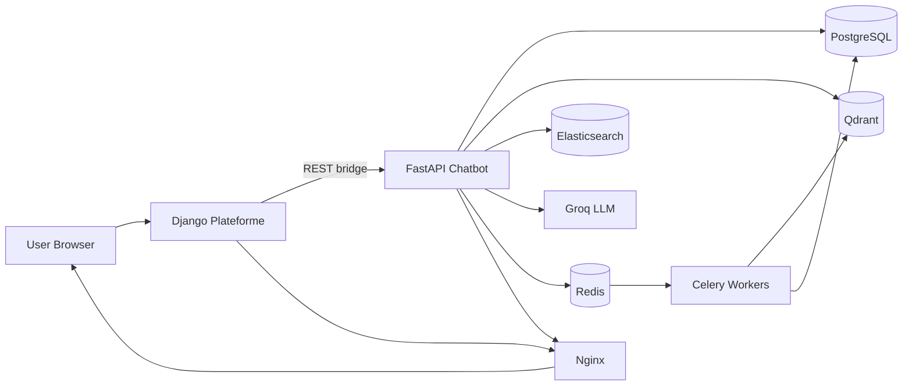
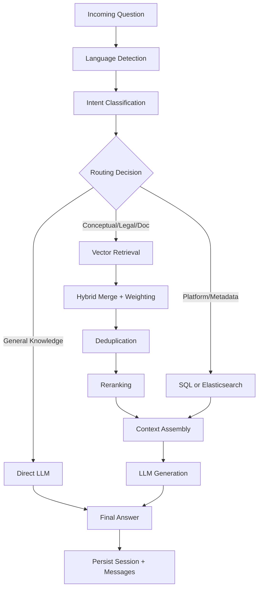
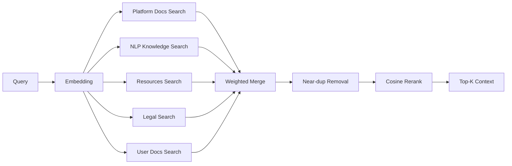

# AI System File Walkthrough

This document explains the files you shared and how the system works end-to-end.

Scope covered:
- `docker-compose.yml`
- `Plateforme/chatbot/*`
- `fastapi_chatbot/*`

---

## 1) Infrastructure: `docker-compose.yml`

### What it does
- Orchestrates the full platform as a multi-service system:
  - PostgreSQL + pgvector (`db`)
  - Redis (`redis`)
  - Qdrant vector DB (`qdrant`)
  - Elasticsearch (`elasticsearch`)
  - Django app (`django`)
  - FastAPI chatbot API (`fastapi`)
  - FastAPI Celery worker (`celery_worker`)
  - Django Celery worker/beat (`django_celery_worker`, `django_celery_beat`)
  - Nginx reverse proxy (`nginx`)

### How it works
- Django calls FastAPI over internal network (`FASTAPI_URL=http://fastapi:8000`).
- FastAPI handles NLP retrieval + LLM orchestration.
- Vector search is in Qdrant; lexical/entity search is in Elasticsearch.
- Redis is split by DB index for channels, broker, and result backends (reduces queue collisions).
- Health checks + `depends_on: condition: service_healthy` enforce startup order.

---

## 2) Django App: `Plateforme/chatbot`

## Root files

### `Plateforme/chatbot/__init__.py`
- Package marker for Django app module.

### `Plateforme/chatbot/apps.py`
- Declares `ChatbotConfig` (`name="chatbot"`, verbose name `AI Chatbot`).

### `Plateforme/chatbot/models.py`
- Core relational models:
  - `ChatSession`: per-user session, links to FastAPI session id, title, content context fields.
  - `ChatMessage`: user/bot/system/error messages tied to a session.
  - `ChatFeedback`: per-message rating/comment by user.
- Adds indexes for frequent lookups (`user + updated_at`, `fastapi_session_id`, `session + timestamp`).

### `Plateforme/chatbot/admin.py`
- Admin UI registration + custom list/search/filter for sessions/messages/feedback.
- Includes helper display methods for readable previews and stats.

### `Plateforme/chatbot/content_helpers.py`
- Resolves context objects (tools, courses, corpora, projects, etc.) from platform models.
- Builds context prompts and metadata payloads to inject into chatbot questions.
- Bridges platform content cards to AI context.

### `Plateforme/chatbot/views.py`
- Main Django controller for chatbot frontend + API bridge.
- Key responsibilities:
  - Session lifecycle (create/list/rename/delete/history).
  - Request forwarding to FastAPI endpoints (`/conversation`, `/query`, `/upload_document`, etc.).
  - Rate limiting and request validation.
  - User profile/context enrichment before forwarding.
  - Message persistence in Django DB.
- This file is the integration gateway between web UI and FastAPI intelligence layer.

### `Plateforme/chatbot/urls.py`
- URL routes for UI (`chatbot_interface`) and JSON actions (`ask_bot`, session endpoints).

### `Plateforme/chatbot/tests.py`
- Placeholder test file (currently minimal/empty).

## Migrations

### `Plateforme/chatbot/migrations/__init__.py`
- Migration package marker.

### `Plateforme/chatbot/migrations/0001_initial.py`
- Initial schema creation for `ChatSession`, `ChatMessage`, `ChatFeedback`.

### `Plateforme/chatbot/migrations/0002_chatsession_context_data_chatsession_context_label.py`
- Adds context metadata fields (`context_data`, `context_label`) in one branch.

### `Plateforme/chatbot/migrations/0002_remove_chatsession_pdf_filename_and_more.py`
- Parallel branch migration:
  - removes old PDF-specific fields,
  - adds generalized document/session fields (`document_filename`, `has_documents`, `title`).

### `Plateforme/chatbot/migrations/0003_remove_chatsession_context_data_and_more.py`
- Removes previous context JSON fields.
- Adds content binding fields (`content_type`, `object_id`, `content_title`).

### `Plateforme/chatbot/migrations/0004_merge_20260227_0000.py`
- Merge migration reconciling migration branches.

---

## 3) FastAPI Service: `fastapi_chatbot`

## Root files

### `fastapi_chatbot/.dockerignore`
- Excludes cache/build/local artifacts from Docker context.

### `fastapi_chatbot/.gitignore`
- Excludes environment files, caches, model artifacts, logs, IDE state.

### `fastapi_chatbot/Dockerfile`
- Builds production FastAPI image.
- Installs Python deps and preps runtime for API + embedding model usage.

### `fastapi_chatbot/init_db.py`
- One-shot initializer:
  - verifies DB connectivity,
  - creates schema,
  - ensures Qdrant collections exist.

### `fastapi_chatbot/NLP_INGESTION.md`
- Operational guide for ingestion commands and workflows.

### `fastapi_chatbot/README.md`
- Architecture + API usage documentation for FastAPI chatbot service.

### `fastapi_chatbot/requirements.txt`
- Dependencies for API, async DB, retrieval, embeddings, task queue, and document parsing.

### `fastapi_chatbot/setup.py`
- Setup orchestrator script that runs staged ingestion/init tasks.

### `fastapi_chatbot/test_big_pdf.py`
- Manual test for large PDF parsing/chunking behavior via `pdf_loader`.

### `fastapi_chatbot/test_classify.py`
- Manual sanity test for query classifier intent output.

### `fastapi_chatbot/test_docling_check.py`
- Quick test for Docling/PDF pipeline and keyword extraction.

### `fastapi_chatbot/test_router.py`
- Manual test for router helper behavior (content type extraction + identity detection).

### `fastapi_chatbot/test_search.py`
- Manual test for user-document vector search scores and threshold behavior.

---

## 4) FastAPI app core: `fastapi_chatbot/app`

### `fastapi_chatbot/app/__init__.py`
- Package marker.

### `fastapi_chatbot/app/config.py`
- Pydantic settings model for all runtime config.
- Central constants include:
  - `TOP_K_RESULTS=5`
  - `SIMILARITY_THRESHOLD=0.65`
  - token/history budgets and upload/chunk limits.

### `fastapi_chatbot/app/db.py`
- Async SQLAlchemy engine/session setup.
- Provides DB initialization and request-scoped async session dependency.

### `fastapi_chatbot/app/models.py`
- ORM models for platform docs, NLP knowledge, legal docs, resources, user docs/chunks, chat sessions/messages.

### `fastapi_chatbot/app/schemas.py`
- Pydantic request/response schemas for chat, sessions, documents, and platform queries.

### `fastapi_chatbot/app/celery_app.py`
- Celery app config, queue routing, and worker behavior.

### `fastapi_chatbot/app/main.py`
- FastAPI entrypoint.
- Registers routes, startup/shutdown lifecycle, health endpoints, and high-level API orchestration.

---

## 5) Retrieval stack (deep technical): `fastapi_chatbot/app/services/retrieval`

### `fastapi_chatbot/app/services/retrieval/__init__.py`
- Package marker/exports for retrieval module.

### `fastapi_chatbot/app/services/retrieval/filters.py`

### What it does
- Builds Qdrant server-side filters (`Filter`, `FieldCondition`) for language/legal/resource/user-doc scopes.

### How it works
- `build_language_filter(language, extra)` -> mandatory language condition + optional extras.
- `build_legal_filter(jurisdiction, category, language)` -> optional conjunction of legal constraints.
- `build_user_doc_filter(session_id, owner_id, document_id, document_ids)`:
  - enforces owner/session isolation,
  - supports single doc or many docs (`document_ids` takes precedence).
- `build_resource_filter(resource_type)` -> type filter for resources collection.

### Math/logic perspective
- This module is mostly boolean logic, not numeric scoring.
- Conceptually, it applies a hard constraint set:

$$
\text{CandidateSet} = \{x \in \text{collection} \mid \bigwedge_i c_i(x)=\text{true}\}
$$

- For user docs, this is crucial data isolation:

$$
\text{visible}(x) = (x.owner\_id=u) \land (x.session\_id=s) \land (x.document\_id\in D\ \text{if specified})
$$

This guarantees retrieval only happens over authorized chunks.

### `fastapi_chatbot/app/services/retrieval/search.py`

### What it does
- Per-collection retrieval functions that:
  - encode query,
  - call Qdrant,
  - fetch relational metadata from PostgreSQL,
  - return normalized result dicts.

### How it works
- `search_platform_docs`: semantic search on platform docs.
- `search_nlp_knowledge`: optional language filter + threshold `0.45`.
- `search_resources`: fetches extra candidates (`k*2`), then geo-boosts by country/city and trims to `k`.
- `search_legal_documents`: language-prioritized two-stage retrieval with threshold `0.50`.
- `search_user_documents`:
  - strict session/owner/doc filters,
  - threshold `0.05` for explicit targeted doc queries, else `0.15`,
  - entity boost,
  - balanced chunk selection across documents.

### Math behind scoring in `search.py`

1. Base semantic similarity (from Qdrant cosine score):

$$
s_{base} = \cos(\vec{q}, \vec{d})
$$

2. Resource geolocation boost:

$$
s = \min\left(1,\ s_{base} + 0.1\cdot\mathbf{1}_{country\ match} + 0.1\cdot\mathbf{1}_{city\ match}\right)
$$

3. User-document entity boost:

$$
s = \min\left(1,\ s_{base} + 0.06\cdot N_{entity\_matches}\right)
$$

4. Balanced selection for multi-document coverage:
- Round 1: pick at least `MIN_PER_DOC = 2` chunks per file.
- Round 2: fill remaining slots by descending score.
- This avoids one long document dominating all top-k slots.

### `fastapi_chatbot/app/services/retrieval/reranker.py`

### What it does
- Post-processing for final quality:
  - near-duplicate removal,
  - query-doc reranking with fresh embeddings.

### How it works
- `deduplicate(docs)`:
  - drops tiny content (`<20` chars),
  - exact duplicate via MD5 hash,
  - near-duplicate via Jaccard overlap on word sets.
- `rerank(query, docs, top_n)`:
  - re-embeds query and top candidates,
  - computes cosine similarity,
  - sorts by rerank score,
  - returns top `top_n`.

### Math behind reranker

1. Jaccard near-dup detection:

$$
J(A,B)=\frac{|A\cap B|}{|A\cup B|}
$$

- If $J(A,B)\ge 0.85$, documents are considered near-duplicates.

2. Cosine rerank score:

$$
\cos(\vec{q},\vec{d})=\frac{\vec{q}\cdot\vec{d}}{\|\vec{q}\|\|\vec{d}\|+10^{-9}}
$$

- Higher cosine implies higher semantic alignment with the query.

### `fastapi_chatbot/app/services/retrieval/hybrid.py`

### What it does
- Runs cross-collection retrieval and merges sources with source-dependent weights.

### How it works
- Queries:
  - platform docs (`k=4`)
  - nlp knowledge (`k=4`)
  - resources (`k=4`)
  - legal docs (`k=3`, optional)
- Applies weighted score, sorts, deduplicates, reranks, returns final top-k.

### Math behind hybrid weighting

Weighted pre-score:

$$
s_{weighted} = s_{similarity}\cdot w_{source}
$$

Where weights are:
- platform docs: $w=1.1$
- nlp knowledge: $w=1.0$
- legal: $w=1.05$
- resources: $w=1.0 + 0.05\cdot\mathbf{1}_{country} + 0.05\cdot\mathbf{1}_{city}$

Then pipeline:
1. weighted ranking
2. deduplication
3. cosine reranking
4. truncate to `TOP_K_RESULTS`.

This is effectively a two-stage ranker: source-prior + semantic refinement.

---

## 6) Other FastAPI services: `fastapi_chatbot/app/services`

### `fastapi_chatbot/app/services/__init__.py`
- Package marker.

### `fastapi_chatbot/app/services/chat_logic.py`
- Main conversation orchestrator.
- Coordinates: language/intent classification -> routing -> retrieval -> context assembly -> LLM answer -> session persistence.
- Handles document-mode persistence and fallback behavior.

### `fastapi_chatbot/app/services/elasticsearch_service.py`
- Async Elasticsearch integration for multi-index lexical/entity search.
- Uses language-aware query construction and field boosting.

### `fastapi_chatbot/app/services/language.py`
- Language detection utilities (Arabic heuristic + detector fallback) normalized to `ar/en/fr`.

### `fastapi_chatbot/app/services/platform_queries.py`
- SQL-backed platform metadata queries (resources/events/authors/user contributions).

## Classifier

### `fastapi_chatbot/app/services/classifier/__init__.py`
- Exports classifier factory/types.

### `fastapi_chatbot/app/services/classifier/engine.py`
- Intent classification engine with confidence scoring and ambiguity handling.
- Routes between user, platform, legal, bug, document, conceptual, and general intents.

### `fastapi_chatbot/app/services/classifier/patterns.py`
- Trilingual regex/pattern bank + helper extraction (e.g., resource type).

## Router

### `fastapi_chatbot/app/services/router/__init__.py`
- Package marker.

### `fastapi_chatbot/app/services/router/engine.py`
- Executes intent-to-source routing decisions.
- Chooses retrieval backend(s) and composes structured routing results.

## LLM

### `fastapi_chatbot/app/services/llm/__init__.py`
- Package marker.

### `fastapi_chatbot/app/services/llm/client.py`
- Groq client wrapper with retry/backoff and response generation methods.

### `fastapi_chatbot/app/services/llm/prompts.py`
- Prompt templates and behavioral guardrails (multilingual response policy + source/use constraints).

## Memory

### `fastapi_chatbot/app/services/memory/__init__.py`
- Package marker.

### `fastapi_chatbot/app/services/memory/session.py`
- Session persistence utilities and history/summary budget management.

### `fastapi_chatbot/app/services/memory/tokens.py`
- Token estimation helper used for budget-aware truncation.

## Documents

### `fastapi_chatbot/app/services/documents/__init__.py`
- Exports document service/processor/embedding utilities.

### `fastapi_chatbot/app/services/documents/service.py`
- High-level document lifecycle service (upload/list/status/delete + queueing).

### `fastapi_chatbot/app/services/documents/processor.py`
- Raw file text extraction and chunking pipeline for PDF/DOCX/XLSX/TXT.

### `fastapi_chatbot/app/services/documents/embeddings.py`
- Embedding model loading + vector encoding APIs.

### `fastapi_chatbot/app/services/documents/entities.py`
- Lightweight regex/entity extraction utilities used for retrieval boosting.

## Qdrant

### `fastapi_chatbot/app/services/qdrant/__init__.py`
- Exports Qdrant client + collection constants.

### `fastapi_chatbot/app/services/qdrant/client.py`
- Qdrant wrapper for collection management, upsert, search, and filtered deletes.

### `fastapi_chatbot/app/services/qdrant/collections.py`
- Defines collection names and payload schema conventions.

---

## 7) Ingestion module: `fastapi_chatbot/app/ingestion`

### `fastapi_chatbot/app/ingestion/__init__.py`
- Package marker.

### `fastapi_chatbot/app/ingestion/pdf_loader.py`
- PDF text extraction + chunking (Docling/PyPDF2 strategies), cleanup, section filtering.

### `fastapi_chatbot/app/ingestion/xml_loader.py`
- JATS/XML parsing and chunking with section-aware handling.

### `fastapi_chatbot/app/ingestion/ingest_nlp_resources.py`
- Bulk ingestion of external NLP docs into DB + Qdrant with checkpointing.

### `fastapi_chatbot/app/ingestion/ingest_nlp_knowledge.py`
- Seeds curated NLP concept knowledge base.

### `fastapi_chatbot/app/ingestion/ingest_legal_docs.py`
- Seeds legal/regulatory corpus and vectors.

### `fastapi_chatbot/app/ingestion/ingest_platform_docs.py`
- Ingests platform docs corpus.

### `fastapi_chatbot/app/ingestion/ingest_resources.py`
- Ingests resources corpus (articles/datasets/projects/etc.).

### `fastapi_chatbot/app/ingestion/cleanup_nlp.py`
- Controlled cleanup utility for NLP corpus entries/index points.

---

## 8) Task module: `fastapi_chatbot/app/tasks`

### `fastapi_chatbot/app/tasks/__init__.py`
- Task auto-import registry for Celery discovery.

### `fastapi_chatbot/app/tasks/document_tasks.py`
- Async background document processing task:
  - extract,
  - clean,
  - chunk,
  - embed,
  - persist DB + Qdrant.

### `fastapi_chatbot/app/tasks/ingestion_tasks.py`
- Background ingestion helpers (legal batch ingestion, URL crawl/index).

### `fastapi_chatbot/app/tasks/summary_tasks.py`
- Session summarization tasks triggered by history growth.

### `fastapi_chatbot/app/tasks/maintenance_tasks.py`
- Maintenance/reindex jobs for collections.

---

## 9) End-to-end execution flow

1. User sends request to Django chatbot endpoint.
2. Django validates/rate-limits/enriches payload and forwards to FastAPI.
3. FastAPI classifies intent and routes query.
4. Retrieval stack searches one/many collections with filters.
5. Hybrid stage merges, deduplicates, reranks, returns top context.
6. LLM client generates final answer with prompt guardrails.
7. Session/messages saved; optional background tasks run through Celery.

---

## 10) Why this architecture is strong

- Separation of concerns: Django UX/auth vs FastAPI AI logic.
- Hybrid retrieval: semantic vectors + structured metadata + lexical indices.
- Safety and isolation: owner/session filters for user docs.
- Quality layers: thresholding, balancing, deduplication, reranking.
- Scalability: async API + Celery workers + independent services.

---

## 11) Visual Version (Flowcharts)

## 11.1 Global system flow

## 11.2 Query processing pipeline

## 11.3 Retrieval internals

---

## 12) Academic Version (Formal + Theoretical)

This section reframes the implementation as an information retrieval and ranking system.

## 12.1 Problem formalization

Given a user query $q$, the system seeks a ranked list of passages:

$$
\mathcal{R}(q) = [d_1, d_2, \dots, d_k]
$$

that maximizes response utility under constraints:

1. Relevance to query semantics.
2. Security/ownership constraints (for private docs).
3. Diversity/coverage across sources or uploaded files.
4. Token budget constraints for downstream generation.

## 12.2 Retrieval objective

For each candidate document $d$ from source $s$:

$$
  ext{score}_{base}(q,d)=\cos(\mathbf{e}(q),\mathbf{e}(d))
$$

where $\mathbf{e}(\cdot)$ is the embedding function.

Source-aware pre-ranking is:

$$
  ext{score}_{w}(q,d,s)=\text{score}_{base}(q,d)\cdot w_s
$$

with implemented priors $w_s$ such as platform $1.1$, legal $1.05$, and resource dynamic boosts.

## 12.3 Constraint filtering as feasible-set reduction

Filters define feasible candidates $\Omega$:

$$
\Omega = \{d \mid C_{lang}(d) \land C_{jur}(d) \land C_{owner}(d) \land C_{session}(d) \land C_{doc}(d)\}
$$

This is equivalent to a constrained optimization over $\Omega$ rather than over the full corpus.

## 12.4 Feature-augmented scoring in implemented code

1. Resource localization boost:

$$
  ext{score}=\min\big(1,\text{score}_{base}+0.1\cdot\mathbb{1}_{country}+0.1\cdot\mathbb{1}_{city}\big)
$$

2. Entity-match boost for user documents:

$$
  ext{score}=\min\big(1,\text{score}_{base}+0.06\cdot n_{entity\_matches}\big)
$$

3. Thresholded retrieval:

$$
d \in \mathcal{H} \iff \text{score}_{base}(q,d) \ge \tau
$$

where $\tau$ is task-dependent (e.g., lower for explicit doc targeting).

## 12.5 Deduplication theory

Near-duplicate removal uses Jaccard similarity over token sets:

$$
J(A,B)=\frac{|A\cap B|}{|A\cup B|}
$$

and the decision rule:

$$
J(A,B)\ge0.85 \Rightarrow \text{duplicate}
$$

This is a high-precision dedup policy suited to chunk-level RAG where lexical overlap is strong for repeated fragments.

## 12.6 Reranking stage

After merge and dedup, reranking recomputes query-document cosine on top candidates:

$$
  ext{score}_{rerank}(q,d)=\frac{\mathbf{e}(q)\cdot\mathbf{e}(d)}{\|\mathbf{e}(q)\|\|\mathbf{e}(d)\|+\epsilon}
$$

with $\epsilon=10^{-9}$ for numerical stability.

This acts as a second-stage ranker that improves ordering quality after heterogeneous-source fusion.

## 12.7 Coverage-aware selection in multi-doc mode

Balanced retrieval enforces a minimum per-document quota:

$$
\forall f\in\mathcal{F},\quad |\mathcal{R}_f|\ge m
$$

with $m=2$ before global top-score filling.

Interpretation: this is a constrained diversification strategy reducing source collapse.

## 12.8 Computational view

Let $N$ be candidate chunks retrieved pre-rerank and $k$ final output size.

1. Approximate vector search in ANN index: sublinear in corpus size (index dependent).
2. Dedup Jaccard worst-case pair comparisons in naive form: $O(N^2)$.
3. Reranking over truncated set (here up to about $2k$): $O(kd)$ for dot products, where $d$ is embedding dimension.

Practical design choice in code: cap rerank candidates to keep latency bounded.

---

## 13) Bilingual Companion (English / Francais)

## 13.1 Architecture summary

| English | Francais |
|---|---|
| Django handles web integration, auth/session bridge, and UI endpoints. | Django gere l'integration web, le pont d'authentification/session et les endpoints UI. |
| FastAPI handles AI orchestration: intent, routing, retrieval, generation. | FastAPI gere l'orchestration IA: intention, routage, retrieval et generation. |
| Qdrant provides semantic vector retrieval for knowledge and documents. | Qdrant fournit la recherche semantique vectorielle pour la connaissance et les documents. |
| Elasticsearch supports lexical/entity-oriented platform search. | Elasticsearch prend en charge la recherche lexicale et orientee entites sur la plateforme. |
| Redis + Celery execute asynchronous processing (documents, summaries, ingestion). | Redis + Celery executent le traitement asynchrone (documents, resumes, ingestion). |

## 13.2 Retrieval summary

| English | Francais |
|---|---|
| Filters enforce strict constraints (language, jurisdiction, owner, session, document). | Les filtres imposent des contraintes strictes (langue, juridiction, proprietaire, session, document). |
| Hybrid search merges multiple sources with source-specific weights. | La recherche hybride fusionne plusieurs sources avec des poids specifiques a chaque source. |
| Deduplication removes exact and near-duplicate chunks (Jaccard >= 0.85). | La deduplication supprime les doublons exacts et proches (Jaccard >= 0.85). |
| Reranking recalculates cosine relevance for better final ordering. | Le reranking recalcule la pertinence cosine pour un meilleur ordre final. |
| Multi-document balancing ensures coverage across uploaded files. | L'equilibrage multi-documents garantit la couverture de plusieurs fichiers televerses. |

## 13.3 Math summary

| English | Francais |
|---|---|
| Base relevance is cosine similarity between query and document embeddings. | La pertinence de base est la similarite cosinus entre les embeddings de la requete et du document. |
| Final ranking uses weighted fusion followed by reranking. | Le classement final utilise une fusion ponderee suivie d'un reranking. |
| Extra boosts are applied for location/entity matches with upper cap at 1.0. | Des bonus supplementaires sont appliques pour les correspondances lieu/entite avec un plafond a 1.0. |
| The pipeline combines constraints + relevance + diversification. | Le pipeline combine contraintes + pertinence + diversification. |

## 13.4 Practical reading guide

| English | Francais |
|---|---|
| Start with `app/main.py`, then `chat_logic.py`, then retrieval modules. | Commencez par `app/main.py`, puis `chat_logic.py`, puis les modules de retrieval. |
| For scoring details, focus on `retrieval/search.py`, `hybrid.py`, and `reranker.py`. | Pour les details de score, concentrez-vous sur `retrieval/search.py`, `hybrid.py` et `reranker.py`. |
| For platform integration, read Django `chatbot/views.py` and `content_helpers.py`. | Pour l'integration plateforme, lisez `chatbot/views.py` et `content_helpers.py`. |
