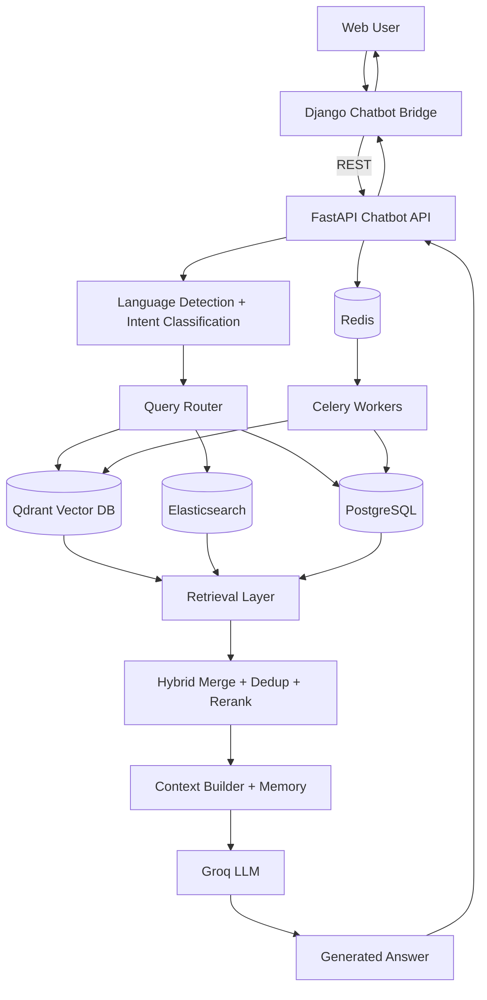

# Chatbot System Design Report

## 1. Introduction

This report presents a technical system design analysis of the chatbot stack implemented in this repository, with emphasis on the Django bridge application ([Plateforme/chatbot](Plateforme/chatbot)), the FastAPI AI service ([fastapi_chatbot/app](fastapi_chatbot/app)), and surrounding infrastructure ([docker-compose.yml](docker-compose.yml)).

The system is a production-oriented multilingual Retrieval-Augmented Generation (RAG) architecture for Arabic, French, and English NLP use cases. It combines:

- Intent-aware routing
- Hybrid retrieval over multiple corpora
- Vector search with Qdrant
- Structured metadata queries over PostgreSQL and Elasticsearch
- Prompt-controlled LLM generation through Groq
- Background processing with Celery

The objective of this document is to describe the full architecture, file-level responsibilities, algorithms, and mathematical foundations in an academic, implementation-grounded style.

## 2. System Overview

At a high level, the platform is decomposed into two application tiers and several data/infra services:

- Django tier (UI + auth + session bridge): [Plateforme/chatbot/views.py](Plateforme/chatbot/views.py)
- FastAPI tier (AI orchestration): [fastapi_chatbot/app/main.py](fastapi_chatbot/app/main.py)
- Relational persistence: PostgreSQL ([fastapi_chatbot/app/models.py](fastapi_chatbot/app/models.py), [Plateforme/chatbot/models.py](Plateforme/chatbot/models.py))
- Semantic vector retrieval: Qdrant ([fastapi_chatbot/app/services/qdrant/client.py](fastapi_chatbot/app/services/qdrant/client.py))
- Lexical search: Elasticsearch ([fastapi_chatbot/app/services/elasticsearch_service.py](fastapi_chatbot/app/services/elasticsearch_service.py))
- Async workers: Celery + Redis ([fastapi_chatbot/app/celery_app.py](fastapi_chatbot/app/celery_app.py), [fastapi_chatbot/app/tasks](fastapi_chatbot/app/tasks))

User requests enter through Django, are normalized and forwarded to FastAPI, then pass through language detection, intent classification, routing, retrieval, and LLM response generation. Responses and message traces are persisted in both service layers for session continuity and UI history.

## 3. Full Architecture

### 3.1 Deployment and Service Topology

The orchestration file [docker-compose.yml](docker-compose.yml) defines:

- Core stores: `db`, `redis`, `qdrant`, `elasticsearch`
- Application services: `django`, `fastapi`, `celery_worker`
- Schedulers/workers: `django_celery_worker`, `django_celery_beat`
- Reverse proxy: `nginx`

Key implementation notes:

- Django communicates with FastAPI via internal URL `http://fastapi:8000`
- FastAPI and Celery worker share model/embedding/runtime config
- Service startup ordering uses health checks + `depends_on`
- Redis DB indices are separated for multiple queue/backend uses

### 3.2 Data and Knowledge Layers

- PostgreSQL (structured records)
- Qdrant (dense vector index + payload filtering)
- Elasticsearch (cross-index lexical/dis_max search)

FastAPI data entities are declared in [fastapi_chatbot/app/models.py](fastapi_chatbot/app/models.py):

- Knowledge bases: `PlatformDoc`, `NLPKnowledge`, `Resource`, `LegalDocument`
- User document pipeline: `UserDocument`, `DocumentChunk`
- Dialogue state: `ChatSession`, `ChatMessage`

Django bridge entities are declared in [Plateforme/chatbot/models.py](Plateforme/chatbot/models.py):

- UI-side `ChatSession`, `ChatMessage`, `ChatFeedback`

### 3.3 End-to-End Architecture Diagram



## 4. Pipeline Description

### 4.1 Request Lifecycle

1. Django receives `ask` request in [Plateforme/chatbot/views.py](Plateforme/chatbot/views.py).
2. User/session/context metadata are normalized.
3. Django forwards to FastAPI endpoint(s) in [fastapi_chatbot/app/main.py](fastapi_chatbot/app/main.py):
   - `/conversation`, `/query`, `/ask_document`, `/platform/search`, `/legal_search`, etc.
4. FastAPI orchestration in [fastapi_chatbot/app/services/chat_logic.py](fastapi_chatbot/app/services/chat_logic.py):
   - language detection
   - intent classification
   - route selection
   - retrieval/context assembly
   - LLM generation
   - persistence
5. Response is returned to Django and stored in Django-side message history.

### 4.2 Processing Pipeline

```text
User Query
-> Language Detection
-> Intent Classification (confidence + ambiguity checks)
-> Query Router (source-specific strategy)
-> Retrieval Layer (Qdrant / ES / PostgreSQL)
-> Hybrid Merge + Deduplication + Reranking
-> Context Construction + Session Memory
-> LLM Generation (Groq)
-> Persist Messages + Session Updates
-> Final Response
```

## 5. Module-by-Module Analysis

## 5.1 Language Detection Module

Primary file: [fastapi_chatbot/app/services/language.py](fastapi_chatbot/app/services/language.py)

### File Summary

- Implements multilingual detection for `ar/en/fr`.
- Uses a hybrid strategy: Unicode-script heuristic + `langdetect` fallback.
- Downstream dependencies: classifier, chat orchestration, prompt language selection.

### Code Logic

- If text too short, defaults to `en`.
- Counts Arabic-script characters in Unicode ranges.
- If Arabic ratio >= 0.3 of alphabetic chars, returns `ar`.
- Else calls `langdetect.detect` and normalizes to `{ar, fr, en}`.

### Mathematical Concepts

Let $N_{ar}$ be Arabic-script letter count and $N_{alpha}$ alphabetic letter count. Arabic decision rule:

$$
\text{lang} = ar \quad \text{if} \quad \frac{N_{ar}}{N_{alpha}} \ge 0.3
$$

This is a threshold classifier over script frequency.

## 5.2 Intent Classification Module

Primary files:

- [fastapi_chatbot/app/services/classifier/patterns.py](fastapi_chatbot/app/services/classifier/patterns.py)
- [fastapi_chatbot/app/services/classifier/engine.py](fastapi_chatbot/app/services/classifier/engine.py)

### File Summary

- `patterns.py`: trilingual regex banks and resource-type extraction mapping.
- `engine.py`: confidence scoring, ambiguity detection, and optional LLM disambiguation.

### Code Logic

- Scores intents independently: `user_query`, `metadata_query`, `platform_query`, `document_query`, `legal_query`, `bug_query`, `general_knowledge`, `conceptual_question`.
- Match score model in [engine.py](fastapi_chatbot/app/services/classifier/engine.py):
  - first match -> base score
  - extra matches -> +0.03 bonus (up to 3 extras)
  - cap at 0.98
- Ambiguity margin constant: `0.15`.
- If top-1 and top-2 differ by < 0.15, confidence is capped at `0.60` and optional LLM fallback can resolve.

### Mathematical Concepts

For intent $i$, with $m_i$ matched patterns and base confidence $b_i$:

$$
\text{score}_i =
\begin{cases}
0, & m_i = 0 \\
\min\left(b_i + 0.03\cdot\min(m_i-1,3),\ 0.98\right), & m_i > 0
\end{cases}
$$

Ambiguity criterion:

$$
\Delta = \text{score}_{(1)} - \text{score}_{(2)}
$$

If $\Delta < 0.15$, confidence is truncated to $\le 0.60$.

## 5.3 Query Router Module

Primary file: [fastapi_chatbot/app/services/router/engine.py](fastapi_chatbot/app/services/router/engine.py)

### File Summary

- Central decision engine mapping intent -> retrieval/persistence strategy.
- Depends on platform query service, Elasticsearch service, retrieval functions.

### Code Logic

- `general_knowledge`: skip retrieval, direct LLM.
- `user_query`: self-scoped contribution lookup (email/user-aware), identity-safe branch.
- `conceptual_question`: targeted semantic search over `nlp_knowledge` (+ optional platform collections).
- `platform_query`: type-aware ES/SQL retrieval with fallback chain.
- `legal_query`: legal collection search with optional language-first behavior.
- `document_query`: user-document chunk search with owner/session filters.
- `metadata_query`: platform stats + navigation hints.

### Mathematical Concepts

Router acts as piecewise function $R(q)$:

$$
R(q) =
\begin{cases}
\text{LLM-direct} & \text{if intent}=\text{general\_knowledge} \\
\text{SQL/ES strategy} & \text{if intent}\in\{\text{platform},\text{metadata},\text{user}\} \\
\text{Vector retrieval strategy} & \text{otherwise}
\end{cases}
$$

It also applies per-collection similarity floors in targeted semantic retrieval.

## 5.4 Retrieval Layer Module

Primary files:

- [fastapi_chatbot/app/services/retrieval/search.py](fastapi_chatbot/app/services/retrieval/search.py)
- [fastapi_chatbot/app/services/retrieval/hybrid.py](fastapi_chatbot/app/services/retrieval/hybrid.py)
- [fastapi_chatbot/app/services/retrieval/reranker.py](fastapi_chatbot/app/services/retrieval/reranker.py)
- [fastapi_chatbot/app/services/retrieval/filters.py](fastapi_chatbot/app/services/retrieval/filters.py)

### File Summary

- `search.py`: collection-specific retrieval and metadata reconstruction.
- `hybrid.py`: weighted fusion across sources + reranking pipeline.
- `reranker.py`: near-duplicate removal + cosine reranking.
- `filters.py`: reusable Qdrant payload constraints.

### Code Logic

- Platform docs, NLP knowledge, resources, legal docs, and user chunks have dedicated search functions.
- User document search includes:
  - owner/session/document filters
  - lower threshold for explicit document targeting (`0.05`) vs broad doc search (`0.15`)
  - entity overlap boost (`+0.06` per match)
  - balanced selection across files (`MIN_PER_DOC=2`)
- Resource search includes geo boost (`+0.1` country and `+0.1` city, clamped to 1.0).
- Hybrid merge weights:
  - platform: `1.1`
  - nlp_knowledge: `1.0`
  - legal: `1.05`
  - resources: `1.0 + geo_boost`

### Mathematical Concepts

Base embedding similarity:

$$
s_{base}(q,d) = \cos(\mathbf{e}(q),\mathbf{e}(d))
$$

Weighted fusion:

$$
s_w(q,d,s) = s_{base}(q,d)\cdot w_s
$$

Resource geo-adjustment (in `search_resources`):

$$
s = \min\left(1,\ s_{base} + 0.1\cdot\mathbb{1}_{country} + 0.1\cdot\mathbb{1}_{city}\right)
$$

Entity boost for user docs:

$$
s = \min\left(1,\ s_{base} + 0.06\cdot n_{entity\_matches}\right)
$$

Near-duplicate rule using Jaccard similarity:

$$
J(A,B)=\frac{|A\cap B|}{|A\cup B|},\quad J\ge0.85\Rightarrow\text{duplicate}
$$

Rerank cosine score:

$$
\text{cos}(q,d)=\frac{\mathbf{q}\cdot\mathbf{d}}{\|\mathbf{q}\|\,\|\mathbf{d}\|+10^{-9}}
$$

## 5.5 Vector Database Module

Primary files:

- [fastapi_chatbot/app/services/qdrant/collections.py](fastapi_chatbot/app/services/qdrant/collections.py)
- [fastapi_chatbot/app/services/qdrant/client.py](fastapi_chatbot/app/services/qdrant/client.py)

### File Summary

- Defines canonical collection names and payload conventions.
- Encapsulates collection creation, upsert, search, and filtered delete.

### Code Logic

- `ensure_collections()` guarantees all expected vector collections exist.
- Search uses HNSW parameterization (`exact=False`, `hnsw_ef=128`) and optional thresholds.
- Payload filters enforce language/jurisdiction/owner/session/doc constraints.

### Mathematical Concepts

Approximate nearest-neighbor search over cosine metric:

$$
\text{NN}_k(q)=\operatorname*{arg\,topk}_{d\in\mathcal{D}}\cos(\mathbf{e}(q),\mathbf{e}(d))
$$

Filtered retrieval solves constrained top-$k$:

$$
\operatorname*{arg\,topk}_{d\in\Omega} s(q,d),\quad
\Omega=\{d\in\mathcal{D}\mid C(d)=1\}
$$

## 5.6 LLM Generation Module

Primary files:

- [fastapi_chatbot/app/services/llm/client.py](fastapi_chatbot/app/services/llm/client.py)
- [fastapi_chatbot/app/services/llm/prompts.py](fastapi_chatbot/app/services/llm/prompts.py)

### File Summary

- Groq client wrapper with retry/backoff and fallback handling.
- Trilingual prompt templates and strict behavioral rules.

### Code Logic

- Retry on rate limit (`RateLimitError`) with exponential backoff (`2s, 4s, 8s`).
- Two generation paths:
  - contextual (`generate_answer_with_context`)
  - no-context (`quick_answer`)
- Prompt composition order:
  - system prompt
  - critical rules
  - source-specific rules
  - identity constraints
  - optional conversation summary/history
  - RAG payload with question

### Mathematical Concepts

LLM acts as conditional generator:

$$
\hat{y}=\operatorname{LLM}(q, c, h, \pi)
$$

where $q$ is user query, $c$ retrieved context, $h$ memory/history, and $\pi$ prompt policy (critical rules + source constraints).

## 5.7 Memory and Session Module

Primary files:

- [fastapi_chatbot/app/services/memory/session.py](fastapi_chatbot/app/services/memory/session.py)
- [fastapi_chatbot/app/services/memory/tokens.py](fastapi_chatbot/app/services/memory/tokens.py)

### File Summary

- Manages session lifecycle and chat history persistence.
- Implements history token budgeting and optional summarization trigger.

### Code Logic

- Persists token estimates per message.
- Selects recent history under fixed budget (`TOKEN_BUDGET_HISTORY`).
- Triggers summarization task when message count exceeds threshold.

### Mathematical Concepts

Heuristic token estimate:

$$
\widehat{T}(x)=\max(1,\lfloor |x|/4\rfloor)
$$

Budgeted history selection is a greedy knapsack-like truncation over recency order.

## 5.8 Documents Module

Primary files:

- [fastapi_chatbot/app/services/documents/service.py](fastapi_chatbot/app/services/documents/service.py)
- [fastapi_chatbot/app/services/documents/processor.py](fastapi_chatbot/app/services/documents/processor.py)
- [fastapi_chatbot/app/services/documents/embeddings.py](fastapi_chatbot/app/services/documents/embeddings.py)
- [fastapi_chatbot/app/services/documents/entities.py](fastapi_chatbot/app/services/documents/entities.py)

### File Summary

- `service.py`: upload validation, metadata persistence, Celery dispatch.
- `processor.py`: PDF/DOCX/XLSX/TXT extraction and sentence-aware chunking.
- `embeddings.py`: multilingual sentence-transformer embedding service.
- `entities.py`: lightweight regex-based entity extraction for retrieval boosting.

### Code Logic

- Upload path validates file type/size and session ownership.
- Existing same-name user docs are deduplicated/replaced before new ingest.
- Chunking uses overlap and sentence boundaries.
- Entity extraction captures names, acronyms, years, and technical NLP terms.

### Mathematical Concepts

Chunking approximates segmentation with overlap window $o$ and chunk target $c$ (in words/tokens), preserving local context continuity:

$$
\text{chunk}_{i+1}=\text{tail}_{o}(\text{chunk}_i)\cup\text{next\_sentences}
$$

Embedding map:

$$
f: \text{text} \rightarrow \mathbb{R}^{768}
$$

## 5.9 Platform Query and Elasticsearch Module

Primary files:

- [fastapi_chatbot/app/services/platform_queries.py](fastapi_chatbot/app/services/platform_queries.py)
- [fastapi_chatbot/app/services/elasticsearch_service.py](fastapi_chatbot/app/services/elasticsearch_service.py)

### File Summary

- `platform_queries.py`: SQL-based metadata and entity lookup across Django domain tables.
- `elasticsearch_service.py`: multilingual dis_max lexical retrieval and result formatting.

### Code Logic

- SQL adapters exist for resources, projects, events, institutions, authors, forum topics, user contributions, stats.
- Resource-type dispatch and unified search abstraction are implemented.
- Elasticsearch query uses language-aware field boosting and dis_max tie-breaker.

### Mathematical Concepts

Disjunction max ranking (lexical search):

$$
\text{score}(d,q)=\max_j s_j(d,q) + \lambda\sum_{k\neq j}s_k(d,q)
$$

where $\lambda$ is tie-breaker (implemented as `0.3`).

## 5.10 Task and Ingestion Module

Primary files:

- [fastapi_chatbot/app/tasks/document_tasks.py](fastapi_chatbot/app/tasks/document_tasks.py)
- [fastapi_chatbot/app/tasks/summary_tasks.py](fastapi_chatbot/app/tasks/summary_tasks.py)
- [fastapi_chatbot/app/tasks/ingestion_tasks.py](fastapi_chatbot/app/tasks/ingestion_tasks.py)
- [fastapi_chatbot/app/tasks/maintenance_tasks.py](fastapi_chatbot/app/tasks/maintenance_tasks.py)
- [fastapi_chatbot/app/ingestion](fastapi_chatbot/app/ingestion)

### File Summary

- Asynchronous processing for documents, summaries, legal batch ingest, and reindexing.
- Ingestion utilities parse PDF/XML corpora and populate PostgreSQL + Qdrant.

### Code Logic

- Document task:
  - clean text
  - detect language
  - chunk
  - embed in batches
  - save DB chunks + Qdrant vectors
- Summarization task condenses old chat turns and prunes old message rows.
- Resource/NLP/legal ingestors support chunk-level insertion and payload metadata.
- `ingest_nlp_resources.py` includes checkpointing for resumable long ingestion.

### Mathematical Concepts

Batched embedding complexity for $N$ chunks, dimension $d$:

$$
\mathcal{O}(N\cdot d)
$$

plus ANN index insertion overhead per point.

## 5.11 Django Integration Module

Primary files:

- [Plateforme/chatbot/views.py](Plateforme/chatbot/views.py)
- [Plateforme/chatbot/content_helpers.py](Plateforme/chatbot/content_helpers.py)
- [Plateforme/chatbot/models.py](Plateforme/chatbot/models.py)
- [Plateforme/chatbot/urls.py](Plateforme/chatbot/urls.py)
- [Plateforme/chatbot/admin.py](Plateforme/chatbot/admin.py)

### File Summary

- `views.py`: frontend gateway, mode handling, rate limiting, context injection, FastAPI forwarding.
- `content_helpers.py`: content-type resolution and contextual prompt/metadata construction.
- `models.py`: UI-side sessions/messages/feedback.
- `urls.py`: route exposure.
- `admin.py`: monitoring and operational visibility.

### Code Logic

- Single `ask_bot` endpoint supports conversation, quick, legal, platform, entity explain, document upload and document QA.
- Context from selected card/resource can be attached as prompt preface.
- Session IDs are synchronized between Django and FastAPI.

### Mathematical Concepts

Django layer mostly handles control flow and API mediation; key measurable logic is request-rate gating (count-based per time window).

## 5.12 Important File Inventory (Role, Logic, Dependents, Math)

The following are the important source files analyzed for this report:

- Infrastructure/config: [docker-compose.yml](docker-compose.yml), [fastapi_chatbot/app/config.py](fastapi_chatbot/app/config.py), [fastapi_chatbot/app/db.py](fastapi_chatbot/app/db.py), [fastapi_chatbot/app/celery_app.py](fastapi_chatbot/app/celery_app.py)
- API and schemas: [fastapi_chatbot/app/main.py](fastapi_chatbot/app/main.py), [fastapi_chatbot/app/schemas.py](fastapi_chatbot/app/schemas.py), [fastapi_chatbot/app/models.py](fastapi_chatbot/app/models.py)
- Core orchestration: [fastapi_chatbot/app/services/chat_logic.py](fastapi_chatbot/app/services/chat_logic.py)
- Classification/routing/language: [fastapi_chatbot/app/services/classifier/engine.py](fastapi_chatbot/app/services/classifier/engine.py), [fastapi_chatbot/app/services/classifier/patterns.py](fastapi_chatbot/app/services/classifier/patterns.py), [fastapi_chatbot/app/services/router/engine.py](fastapi_chatbot/app/services/router/engine.py), [fastapi_chatbot/app/services/language.py](fastapi_chatbot/app/services/language.py)
- Retrieval/vector stack: [fastapi_chatbot/app/services/retrieval/search.py](fastapi_chatbot/app/services/retrieval/search.py), [fastapi_chatbot/app/services/retrieval/hybrid.py](fastapi_chatbot/app/services/retrieval/hybrid.py), [fastapi_chatbot/app/services/retrieval/reranker.py](fastapi_chatbot/app/services/retrieval/reranker.py), [fastapi_chatbot/app/services/retrieval/filters.py](fastapi_chatbot/app/services/retrieval/filters.py), [fastapi_chatbot/app/services/qdrant/client.py](fastapi_chatbot/app/services/qdrant/client.py), [fastapi_chatbot/app/services/qdrant/collections.py](fastapi_chatbot/app/services/qdrant/collections.py)
- LLM/memory/documents: [fastapi_chatbot/app/services/llm/client.py](fastapi_chatbot/app/services/llm/client.py), [fastapi_chatbot/app/services/llm/prompts.py](fastapi_chatbot/app/services/llm/prompts.py), [fastapi_chatbot/app/services/memory/session.py](fastapi_chatbot/app/services/memory/session.py), [fastapi_chatbot/app/services/memory/tokens.py](fastapi_chatbot/app/services/memory/tokens.py), [fastapi_chatbot/app/services/documents/service.py](fastapi_chatbot/app/services/documents/service.py), [fastapi_chatbot/app/services/documents/processor.py](fastapi_chatbot/app/services/documents/processor.py), [fastapi_chatbot/app/services/documents/embeddings.py](fastapi_chatbot/app/services/documents/embeddings.py), [fastapi_chatbot/app/services/documents/entities.py](fastapi_chatbot/app/services/documents/entities.py)
- Platform query adapters: [fastapi_chatbot/app/services/platform_queries.py](fastapi_chatbot/app/services/platform_queries.py), [fastapi_chatbot/app/services/elasticsearch_service.py](fastapi_chatbot/app/services/elasticsearch_service.py)
- Tasks/ingestion: [fastapi_chatbot/app/tasks/document_tasks.py](fastapi_chatbot/app/tasks/document_tasks.py), [fastapi_chatbot/app/tasks/summary_tasks.py](fastapi_chatbot/app/tasks/summary_tasks.py), [fastapi_chatbot/app/tasks/ingestion_tasks.py](fastapi_chatbot/app/tasks/ingestion_tasks.py), [fastapi_chatbot/app/tasks/maintenance_tasks.py](fastapi_chatbot/app/tasks/maintenance_tasks.py), [fastapi_chatbot/app/ingestion/pdf_loader.py](fastapi_chatbot/app/ingestion/pdf_loader.py), [fastapi_chatbot/app/ingestion/xml_loader.py](fastapi_chatbot/app/ingestion/xml_loader.py), [fastapi_chatbot/app/ingestion/ingest_nlp_resources.py](fastapi_chatbot/app/ingestion/ingest_nlp_resources.py), [fastapi_chatbot/app/ingestion/ingest_platform_docs.py](fastapi_chatbot/app/ingestion/ingest_platform_docs.py), [fastapi_chatbot/app/ingestion/ingest_nlp_knowledge.py](fastapi_chatbot/app/ingestion/ingest_nlp_knowledge.py), [fastapi_chatbot/app/ingestion/ingest_resources.py](fastapi_chatbot/app/ingestion/ingest_resources.py), [fastapi_chatbot/app/ingestion/ingest_legal_docs.py](fastapi_chatbot/app/ingestion/ingest_legal_docs.py), [fastapi_chatbot/app/ingestion/cleanup_nlp.py](fastapi_chatbot/app/ingestion/cleanup_nlp.py)
- FastAPI bootstrap/testing: [fastapi_chatbot/init_db.py](fastapi_chatbot/init_db.py), [fastapi_chatbot/setup.py](fastapi_chatbot/setup.py), [fastapi_chatbot/test_search.py](fastapi_chatbot/test_search.py), [fastapi_chatbot/test_classify.py](fastapi_chatbot/test_classify.py), [fastapi_chatbot/test_router.py](fastapi_chatbot/test_router.py), [fastapi_chatbot/test_docling_check.py](fastapi_chatbot/test_docling_check.py), [fastapi_chatbot/test_big_pdf.py](fastapi_chatbot/test_big_pdf.py)
- Django chatbot bridge: [Plateforme/chatbot/views.py](Plateforme/chatbot/views.py), [Plateforme/chatbot/content_helpers.py](Plateforme/chatbot/content_helpers.py), [Plateforme/chatbot/models.py](Plateforme/chatbot/models.py), [Plateforme/chatbot/urls.py](Plateforme/chatbot/urls.py), [Plateforme/chatbot/admin.py](Plateforme/chatbot/admin.py), [Plateforme/chatbot/apps.py](Plateforme/chatbot/apps.py), [Plateforme/chatbot/tests.py](Plateforme/chatbot/tests.py)

For each file above:

- File summary: covered in Sections 5.1 to 5.11 and this inventory
- Core logic: analyzed via class/function behavior and pipeline role
- Mathematical content: detailed where AI/NLP logic is implemented (classification, retrieval, reranking, vector search, prompting)

## 6. Mathematical Foundations

### 6.1 Embedding Space

Text is mapped into a dense vector space:

$$
f: \mathcal{T} \rightarrow \mathbb{R}^{d},\quad d=768
$$

for query $q$ and document $d$:

$$
\mathbf{q}=f(q),\quad \mathbf{d}=f(d)
$$

### 6.2 Similarity Function

Cosine similarity is used throughout retrieval/reranking:

$$
\operatorname{sim}(q,d)=\frac{\mathbf{q}\cdot\mathbf{d}}{\|\mathbf{q}\|\,\|\mathbf{d}\|+\epsilon}
$$

with $\epsilon=10^{-9}$ in reranking code.

### 6.3 Thresholded Candidate Selection

A candidate survives retrieval if:

$$
\operatorname{sim}(q,d)\ge\tau
$$

where $\tau$ is collection/route dependent (e.g., lower in explicit document-targeted mode).

### 6.4 Weighted Multi-Source Fusion

For source $s$ with weight $w_s$:

$$
\operatorname{score}_w(q,d,s)=\operatorname{sim}(q,d)\cdot w_s
$$

Implemented priors emphasize platform and legal content in hybrid merge.

### 6.5 Deduplication and Diversity

Near-duplicate suppression uses Jaccard overlap:

$$
J(A,B)=\frac{|A\cap B|}{|A\cup B|}
$$

with threshold $0.85$.

Multi-document user retrieval introduces a minimum-per-document selection policy before global top-score fill.

## 7. Retrieval-Augmented Generation (RAG) Model

### 7.1 Formal RAG Formulation

Let corpus $\mathcal{D}$, query $q$, retrieved set $D_k$:

$$
D_k=\operatorname*{arg\,topk}_{d\in\mathcal{D}}\operatorname{sim}(q,d)
$$

Context constructor $C(\cdot)$ and generator $G(\cdot)$:

$$
c = C(D_k)
$$

$$
\hat{y}=G(q,c,h,\pi)
$$

where $h$ is conversation memory and $\pi$ is policy prompt.

### 7.2 System-Specific Realization

- Retrieval is conditional on intent and routing policy.
- Context may include:
  - verified platform metadata
  - semantic chunks from knowledge bases
  - user profile context (intent-gated)
  - chat summary/history
- Prompt policy injects safety, disclosure, identity, and source-specific constraints.

## 8. Evaluation Metrics

### 8.1 Intent Classification

Recommended metrics:

- Accuracy: overall correctness
- Precision/Recall/F1 per intent: class-wise reliability
- Confusion matrix: ambiguity and misroute patterns

Why appropriate:

- Intent classes are semantically distinct and route-critical
- Misclassification directly changes retrieval backend and answer quality

### 8.2 Retrieval Quality

Recommended metrics:

- Recall@k
- MRR (Mean Reciprocal Rank)
- nDCG@k

Why appropriate:

- Recall@k measures whether relevant context is retrieved at all
- MRR captures how early first relevant evidence appears
- nDCG captures graded ranking utility for top positions

### 8.3 Generation Quality

Recommended metrics:

- BLEU (n-gram overlap; conservative for factual QA)
- ROUGE (recall-oriented textual overlap)
- BERTScore (semantic similarity in embedding space)
- Human evaluation (faithfulness, usefulness, safety) for final validation

Why appropriate:

- Automatic lexical metrics alone are insufficient for grounded dialog
- Semantic + human evaluation better capture RAG faithfulness and practical quality

## 9. Limitations

1. Rule-heavy intent classification can degrade on unseen phrasing.
2. Token estimation is heuristic (`len/4`) and not tokenizer-accurate.
3. Prompt policy is extensive but still sensitive to model drift.
4. Retrieval thresholds are largely static; limited online adaptation.
5. Elasticsearch and SQL schema coupling assumes stable Django table contracts.
6. Some ingestion scripts use seed-style content and may need richer provenance governance for research rigor.
7. End-to-end benchmark harness is not fully integrated (many tests are script-style sanity tests).

## 10. Possible Improvements

1. Learnable intent classifier on annotated multilingual data with calibrated confidence.
2. Adaptive retrieval thresholds using feedback signals and query difficulty estimates.
3. Cross-encoder reranker for final top-$k$ ordering beyond pure cosine.
4. Tokenizer-accurate budgeting (model-specific tokenizer rather than char heuristic).
5. Unified observability dashboard for route decisions, retrieval traces, and answer faithfulness checks.
6. Stronger evaluation pipeline with labeled intent/retrieval/generation datasets and periodic regression tests.
7. Additional guardrails for legal/document modes with explicit citation extraction and entailment checks.

## 11. Conclusion

The chatbot architecture is a mature hybrid RAG system with strong engineering separation:

- Django handles UI/session/auth mediation.
- FastAPI performs NLP/AI orchestration.
- Retrieval combines vector, lexical, and relational sources.
- Prompt-controlled LLM generation is grounded by route- and source-aware context construction.

Its major strengths are routing modularity, multilingual support, retrieval diversity, and practical operational tooling (Celery ingestion/summarization, collection management, and session persistence). Its next research-grade evolution should focus on adaptive ranking, formal evaluation, and stronger faithfulness guarantees under distribution shift.
