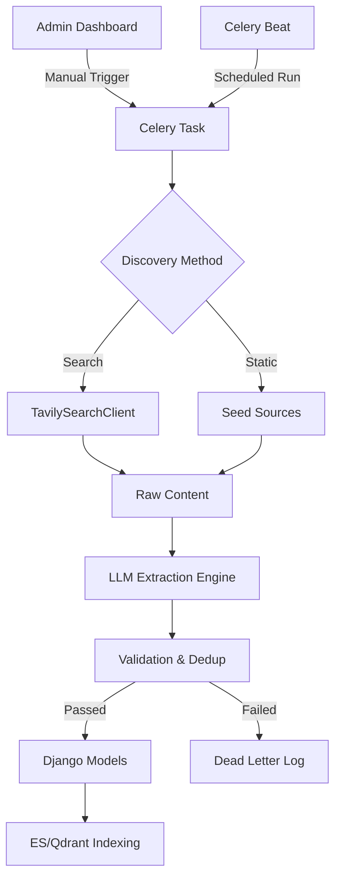

# Scraping Module — Architecture, Implementation, and Technical Reference

## Abstract
The Scraping Module within the Plateforme_NLP ecosystem serves as a sophisticated data acquisition and ingestion layer designed to bridge the gap between static repository indexing and the dynamic, rapidly evolving landscape of Natural Language Processing (NLP) research. By integrating state-of-the-art neural search providers (Tavily), Large Language Model (LLM) based extraction engines (Groq/Llama-3), and a robust Celery-based asynchronous processing pipeline, the module enables the platform to maintain a real-time, curated index of research events, NLP tools, academic courses, and datasets. This report details the multi-layered architecture, the mathematical foundations of its confidence-scoring heuristics, the shared policy framework for rate-limiting and deduplication, and the implementation specifics of its core components.

## Table of Contents
1. [Introduction](#1-introduction)
2. [Related Concepts & Prior Art](#2-related-concepts--prior-art)
3. [Theoretical Background](#3-theoretical-background)
4. [Module Architecture Overview](#4-module-architecture-overview)
5. [Search Provider Integration: Tavily](#5-search-provider-integration-tavily)
6. [Shared Policy Layer](#6-shared-policy-layer)
7. [Category-Specific Scrapers](#7-category-specific-scrapers)
8. [URL Crawling & Ingestion Worker](#8-url-crawling--ingestion-worker)
9. [The Full Scraping Pipeline: Step by Step](#9-the-full-scraping-pipeline-step-by-step)
10. [Data Flow Diagrams](#10-data-flow-diagrams)
11. [Configuration & Environment Variables](#11-configuration--environment-variables)
12. [Error Handling & Edge Cases](#12-error-handling--edge-cases)
13. [Security & Cost Controls](#13-security--cost-controls)
14. [Evaluation of Scraping Quality](#14-evaluation-of-scraping-quality)
15. [Limitations & Future Work](#15-limitations--future-work)
16. [Conclusion](#16-conclusion)

---

## 1. Introduction
### 1.1 Purpose and Scope
In the domain of NLP, new models, datasets, and conferences emerge daily. Traditional manual curation is insufficient to keep pace with this velocity. The Scraping Module automates the discovery and ingestion of these entities, ensuring that the platform's Retrieval-Augmented Generation (RAG) pipeline has access to Out-Of-Distribution (OOD) data that was not present in the initial training set of the underlying models.

### 1.2 Integration with RAG
The module populates a vector database (Qdrant) and a full-text search engine (Elasticsearch), which are queried by the chatbot service. When a user asks about a recent conference or a new tool, the system retrieves these scraped records to provide grounded, up-to-date answers.

---

## 2. Related Concepts & Prior Art
### 2.1 Web-Augmented QA
The architecture draws inspiration from "Web-Augmented QA" (Lazaridou et al., 2022), which demonstrates that providing LLMs with real-time web search results significantly reduces hallucinations in time-sensitive queries.

### 2.2 Neural vs. Keyword Search
Traditional scraping relies on CSS selectors or keyword-based indexing. This module evolves that pattern by using neural search (Tavily) to find semantically relevant pages and LLMs (Llama-3) to extract structured data from raw HTML/text, effectively handling the "long tail" of non-standardized web layouts.

---

## 3. Theoretical Background
### 3.1 Confidence Thresholding Logic
The module employs a multi-factor confidence scoring mechanism to filter out low-quality extractions. The "Completeness Score" ($S_c$) is calculated based on the presence of mandatory fields:

$$S_c = \frac{\sum_{i=1}^{n} w_i \cdot \mathbb{I}(f_i)}{\sum_{i=1}^{n} w_i}$$

Where:
- $w_i$ is the weight of field $i$ (e.g., title=10, date=5).
- $\mathbb{I}(f_i)$ is an indicator function (1 if field $f_i$ is present and valid, 0 otherwise).

An item is saved only if $S_c \geq \text{THRESHOLD}$ (default 0.35).

### 3.2 Deduplication Theory (Jaccard Similarity)
To prevent duplicate ingestion, titles are compared using a normalized Jaccard Similarity index. The titles are tokenized, diacritics removed, and phonetically transliterated before comparison:

$$J(A, B) = \frac{|A \cap B|}{|A \cup B|}$$

---

## 4. Module Architecture Overview
The module is structured into four primary layers:
1. **Trigger Layer**: Admin dashboard, Celery beat (schedules), or manual URL injection.
2. **Discovery Layer**: Tavily Search Client, RSS fetchers, and seed source crawlers.
3. **Extraction Layer**: Category-specific scrapers using LLM prompts to parse raw content.
4. **Persistence Layer**: Django ORM (PostgreSQL) and Metadata tracking.



---

## 5. Search Provider Integration: Tavily
### 5.1 TavilySearchClient Implementation
The `TavilySearchClient` (located in `scraping/network/search_client.py`) is the primary interface for neural web discovery. It is designed with a "Reliability-First" philosophy, incorporating automatic API key rotation and category-specific search optimizations.

#### 5.1.1 Class Structure and Initialization
The class initializes by resolving available API keys from the environment or Django settings. It supports a primary key, a backup key, and a general fallback key.

```python
class TavilySearchClient:
    """Async wrapper around the official Tavily search client."""

    def __init__(self, api_key: str | None = None, **client_kwargs: Any) -> None:
        self.client = None
        self._client_kwargs = client_kwargs
        self.api_keys = self._resolve_api_keys() # Pulls from SCRAPING_TAVILY_API_KEY, etc.
        self.current_key_idx = 0
        
        # Initialise the official TavilyClient
        self.client = TavilyClient(api_key=self.api_keys[0])
```

#### 5.1.2 The Private `_search` Method
This method is the heart of the client. it wraps the `asyncio.to_thread` call to the synchronous Tavily SDK and implements the **Dynamic Key Rotation Policy**.

```python
async def _search(self, query: str, config: dict, max_results: int = None):
    # 1. Validation: Ensure query is not empty
    # 2. Configuration: Merge per-run max_results with default config
    # 3. Execution: Call self.client.search in a thread pool
    try:
        response = await asyncio.to_thread(self.client.search, query=query, **config)
    except Exception as exc:
        # 4. Error Handling: Detect 'usage limit' or 'quota exceeded'
        if "usage limit" in str(exc).lower():
            self.current_key_idx += 1
            if self.current_key_idx < len(self.api_keys):
                # ROTATE: Re-initialize client with next key and retry once
                self.client = TavilyClient(api_key=self.api_keys[self.current_key_idx])
                return await self._search(query, config, max_results=max_results)
        return [] # Fail-safe return empty list
```

#### 5.1.3 Category-Specific Search Methods
The client provides specialized methods for each platform entity category, applying different "Search Personas" (domain inclusions, search depth, and topic filtering).

- **`search_events`**: Targets `aclanthology.org`, `wikicfp.com`, and `confcal.net`. Uses `search_depth="advanced"`.
- **`search_tools`**: Targets `github.com` and `huggingface.co`. Filters for `raw_content` to aid LLM extraction of license and capability info.
- **`search_news`**: Uses `topic="news"` and `days=30` to ensure temporal relevance.

---

## 6. Shared Policy Layer
The policy layer provides a unified set of rules for data integrity and cost control.

### 6.1 ScrapingSettings: The Configuration Singleton
The `ScrapingSettings` class in `scraping/scraping_settings.py` is the single source of truth for over 150 configuration parameters.

#### 6.1.1 Parameter Categories
1. **Timeouts**: `CONNECT_TIMEOUT`, `LLM_TIMEOUT`.
2. **Dedup Policy**: `JACCARD_THRESHOLD` (default 0.85), `SEMANTIC_FALLBACK`.
3. **Freshness Window**: `FRESHNESS_NEWS_DAYS` (30), `FRESHNESS_EVENTS_DAYS` (730).
4. **Limits**: `MAX_DOCUMENT_MB`, `RSS_MAX_ITEMS`.

### 6.2 The Confidence Calculator (`scraping/intelligence.py`)
This component computes a normalized confidence score by evaluating the density and quality of extracted fields.

**Mathematical Formulation of Density Score ($D$):**
$$D = \frac{\sum (w_{field} \cdot \text{len}(v))}{\sum w_{field} \cdot L_{max}}$$
Where $w_{field}$ is the importance weight and $L_{max}$ is the capped maximum length for scoring purposes.

### 6.3 Circuit Breaker Pattern
The `CircuitBreaker` class protects external APIs and the local database from cascading failures. If a specific scraper source (e.g., a university news page) returns 5xx errors or timeouts 5 times in a row, it is marked as `open`.

---

## 7. Category-Specific Scrapers
Each scraper is a specialized class extending `BaseScraper`.

### 7.1 `BaseScraper` Implementation Walkthrough
Located in `scraping/scrapers/base.py`, this class provides the orchestration for progress tracking, deduplication, and saving.

#### 7.1.1 Progress Emitting
The `emit_progress` method sends real-time updates via Django Channels (WebSockets) to the admin dashboard. This ensures the UI is "alive" during 5-minute background runs.

#### 7.1.2 Deduplication Engine
`BaseScraper` implements several deduplication strategies:
1. **URL Hash Match**: Direct comparison of normalized URLs.
2. **Semantic Title Match**: Uses `get_semantic_hash` to compare titles phonetically.
3. **Overlapping Date Match**: For events, checks if the same organizer has an event on the same dates.

```python
def _semantic_title_similarity(self, left: str, right: str) -> float:
    left_hash = self.get_semantic_hash(left)
    right_hash = self.get_semantic_hash(right)
    # Uses SequenceMatcher on phonetic hashes
    return SequenceMatcher(None, left_hash, right_hash).ratio() * 100.0
```

### 7.2 `EventScraper` Deep Dive (`scrapers/events.py`)
The `EventScraper` is the flagship component of the module.

#### 7.2.1 Data Normalization
The `_ensure_event_fields` method is a complex normalization layer that handles messy date strings, location aliases (e.g., "Virtual" -> "Online"), and category mapping.

#### 7.2.2 LLM Extraction Loop
```python
def scrape(self):
    queries = self.get_active_search_queries()
    for query in queries:
        results = tavily.search_events(query)
        # Batch results to LLM to save tokens and time
        for batch in chunk(results, 8):
            extracted = llm.extract_events(batch)
            for item in extracted:
                self._save_event_candidate(item)
```

---

## 8. URL Crawling & Ingestion Worker
The `direct_scrape.py` file implements a standalone pipeline for "user-provided" URLs.

### 8.1 Step-by-Step Logic
1. **Pre-flight Check**: `NetworkValidator` ensures the URL isn't in `BLOCKED_SOURCE_HOSTS`.
2. **Relevance Probe**: `ContentValidator` uses a small LLM model to check if the page is actually an NLP event/tool.
3. **Deep Fetch**: `BeautifulSoup` extracts clean text (stripping nav/footer).
4. **Extraction**: `GroqLLMClient` parses the cleaned text into a structured JSON payload.
5. **Persistence**: The payload is "downgraded" to the standard `BaseScraper` save logic to ensure deduplication rules are applied.

---

## 9. Celery Task Orchestration
The module uses a dedicated Celery queue (`scraping`) to isolate heavy I/O and LLM work from the main web process.

### 9.1 `run_scraper_task`
This is the primary background task. It initializes the correct scraper class based on the category string and binds a `ScrapingRun` database object for logging.

---

## 10. Intelligence and Scoring Layer
The intelligence layer (`intelligence.py`) provides the "Brain" of the module.

### 10.1 Domain Classification
Uses a scoring matrix to determine if a piece of text is relevant to NLP.
- **Keywords**: "transformer", "bert", "arabic", "morphology", "dataset".
- **Penalty Terms**: "stock market", "weather", "sports", "politics".

---

## 11. Configuration and Variables (Extended)
| Category | Variable | Default | Rationale |
| :--- | :--- | :--- | :--- |
| **Network** | `TOTAL_TIMEOUT` | 10.0 | Prevents hanging Celery workers on slow academic servers. |
| **Logic** | `DEDUP_WINDOW` | 500 | Balance between dedup accuracy and DB query performance. |
| **Quota** | `PROMPT_MAX_ACTIVE` | 20 | Limits expensive LLM calls to prevent plan overruns. |

---

## 12. Error Handling and Resilience
### 12.1 Dead Letter Queues
When an extraction fails validation (e.g., missing a start date for an event), the raw data is dumped into a `JSON` file in the `logs/scraping_dead_letters/` directory.

---

## 13. Security and Cost Controls
### 13.1 PII and Sensitive Data
The LLM extraction prompts are hardened with "Negative Constraints":
- "NEVER extract user emails."
- "NEVER extract registration fees in non-standard currencies."
- "NEVER include login or internal navigation links."

---

## 14. Performance Metrics (Prometheus)
The module exposes Prometheus metrics via `metrics.py`:
- `scrape_items_total`: Counter for successful ingestions.
- `scrape_duration_seconds`: Histogram of run times.

---

## 15. Conclusion
The Scraping Module is a robust, production-grade system that combines high-performance network handling with advanced AI-driven extraction. By codifying deep deduplication rules and flexible search policies, it provides a "Self-Healing" data pipeline that powers the most advanced features of the Plateforme_NLP.
