# Rapport d'Ingénierie Détaillé et PFE : Architecture du Sanad AI Aggregator

**Auteurs** : Équipe d'Ingénierie Data & Applied AI  
**Projet** : Plateforme NLP Arabophone (Sanad)  
**Titre** : Conception, Implémentation et Mise à l'Échelle d'un Agent d'Extraction de Données Autonome Piloté par LLM

---

## Table des Matières

1. [Contexte et Problématique Initiale](#1-contexte-et-problématique-initiale)
2. [Évolution Paradigmatique : Du DOM Parsing à l'Intelligence Agentique](#2-évolution-paradigmatique--du-dom-parsing-à-lintelligence-agentique)
3. [Architecture Globale du Système (Macro-Architecture)](#3-architecture-globale-du-système-macro-architecture)
4. [Couche de Découverte : L'Intégration de Tavily Search](#4-couche-de-découverte--lintégration-de-tavily-search)
5. [Couche d'Extraction Sémantique : Modèles de Langage et Pydantic](#5-couche-dextraction-sémantique--modèles-de-langage-et-pydantic)
6. [Système de Validation et d'Assurance Qualité (QA)](#6-système-de-validation-et-dassurance-qualité-qa)
7. [Taxonomie et Piliers de Données (Les 6 extracteurs)](#7-taxonomie-et-piliers-de-données-les-6-extracteurs)
8. [Orchestration Asynchrone et File d'Attente (Celery / Redis)](#8-orchestration-asynchrone-et-file-dattente-celery--redis)
9. [Couplage RAG (Retrieval-Augmented Generation) et Vectorisation](#9-couplage-rag-retrieval-augmented-generation-et-vectorisation)
10. [Tolérance aux Pannes, Sécurité et Résilience Réseau](#10-tolérance-aux-pannes-sécurité-et-résilience-réseau)
11. [Guide de Configuration, Déploiement et DevOps](#11-guide-de-configuration-déploiement-et-devops)
12. [Conclusion et Perspectives d'Ingénierie (Future Work)](#12-conclusion-et-perspectives-dingénierie-future-work)

---

## 1. Contexte et Problématique Initiale

La création d'une plateforme exhaustive dédiée au traitement du langage naturel (NLP), avec une emphase particulière sur l'écosystème arabophone et dialectal (MENA, Maghreb), nécessite une ingestion continue et massive d'informations de très haute qualité. La donnée cible est hautement hétérogène et fragmentée. Elle comprend :
- Des événements académiques (conférences EMNLP, ACL, WANLP).
- Des dépôts GitHub et modèles HuggingFace open-source.
- Des articles de recherche (arXiv, Semantic Scholar).
- Des cursus universitaires et des opportunités (bourses, thèses).

**Le frein majeur à la mise à l'échelle d'un tel graphe de connaissances réside dans la stratégie d'acquisition de la donnée.** Construire et maintenir une centaine de scrapers basés sur des règles fixes (`lxml`, `BeautifulSoup`) pour chaque source académique mondiale est mathématiquement et logistiquement intenable pour une équipe technique restreinte. 

C'est pour répondre à cette inertie technologique que le module **Sanad AI Aggregator** a été architecturé. Ce sous-système de la plateforme NLP transforme une logique d'acquisition "pull" statique en un Agent de découverte "autonome" et sémantique.

---

## 2. Évolution Paradigmatique : Du DOM Parsing à l'Intelligence Agentique

### 2.1. Les limites du Scraping Déterministe
Historiquement, extraire le titre, la date et le lieu d'un événement depuis le site de l'EMNLP requiert un fichier de règles strictes :
```python
# Modèle obsolète (DOM Parsing)
title = soup.find('h1', class_='conf-title').text
start_date = soup.select_one('.date-box > span:nth-child(1)').text
```
Cette méthode souffre de trois vulnérabilités critiques :
1. **Couplage Structurel (Structural Coupling)** : Toute mise à jour de la classe CSS du site distant casse le pipeline.
2. **Absence de Standardisation** : Les dates (ex: "November 12th, 2026", "12/11/2026", "١٢ نوفمبر ٢٠٢٦") nécessitent des parsers complexes et faillibles.
3. **Incapacité Multilingue native** : Extraire des entités pour les normaliser en Anglais et en Arabe implique des appels API externes de traduction.

### 2.2. L'Alternatif Agentique (Sanad AI Aggregator)
Le nouveau paradigme supprime la notion de "sélecteur CSS". L'agent navigue dans le bruit HTML, isole le texte brut (Markdown ou plain-text) et injecte ce contexte massif dans une fenêtre de contexte (Context Window) d'un Grand Modèle de Langage (LLM).

Le LLM agit alors comme un compilateur sémantique universel : **il reçoit du texte non structuré (Unstructured Data) et retourne le schéma relationnel exact attendu par la base de données (Structured JSON Data).** L'ingénierie se déplace du *CSS Selector* vers le *Prompt Engineering*.

---

## 3. Architecture Globale du Système (Macro-Architecture)

L'architecture est découpée en micro-services communiquant via des middlewares. Voici le flux logique complet de la découverte à la vectorisation.

```mermaid
graph TD
    subgraph "Interface & Déclenchement"
        A[Django Admin / UI] -->|Requête de Run| B(API run_scraper)
        C[Celery Beat / Cron] -->|Tâche Planifiée| B
    end

    subgraph "Orchestration Asynchrone"
        B --> D[(Redis Message Broker)]
        D --> E{Django Celery Worker}
    end

    subgraph "Discovery & Network Layer"
        E -->|Ontologie & Mots clés| F[Module Intelligence]
        F -->|Génération de Prompts| G[Tavily Search Client]
        G -->|API HTTP| H((Internet / Web Média))
        H -->|Résultats bruts HTML/JSON| G
    end

    subgraph "LLM Extraction Layer"
        G -->|Nettoyage Contextuel| I[Groq LLM Client]
        I -->|Instructions Pydantic| J(Llama 3 8B/70B)
        J -->|JSON structuré| I
    end

    subgraph "Validation & Persistence"
        I --> K{ExtractionQualityValidator}
        K -->|Confiance < Seuil| L[Log Rejet / Dead Letter]
        K -->|Confiance >= Seuil| M[(PostgreSQL / Django ORM)]
    end

    subgraph "RAG Integration"
        M -->|Signal post_save| N[Modèle d'Embedding / spaCy]
        N --> O[(Qdrant / ElasticSearch Vector DB)]
    end
```



---

## 4. Couche de Découverte : L'Intégration de Tavily Search

### 4.1. Expansion Ontologique (`intelligence.py`)
Le système n'effectue pas une recherche aléatoire. Il intègre un moteur de requêtes sémantiques. Le fichier `intelligence.py` gère l'expansion de mots clés.
Si l'utilisateur cible la catégorie `events` (Événements), le moteur construit dynamiquement des requêtes heuristiques de recherche telles que :
- `"Arabic NLP conference 2026"`
- `"MENA NLP workshop call for papers"`
- `"التعرف على الكلام العربي مؤتمر"`

### 4.2. Tavily Agentic Search
Au lieu de maintenir une armée de proxies rotatifs et de gérer des instances Selenium PhantomJS (coûteuses en RAM), le système délègue la navigation pure à l'API **Tavily**. 
Tavily a été sélectionné pour sa capacité à retourner un "Search Context" optimisé pour les LLMs. Contrairement aux SERP Google standards (limitées aux balises `<title>` et `<meta>`), Tavily traverse les sites trouvés pour en extraire le `raw_content`.

---

## 5. Couche d'Extraction Sémantique : Modèles de Langage et Pydantic

Une fois le contenu (les "SearchResults" de Tavily) rapatrié, le pipeline isole les candidats.

### 5.1 Sérialisation Stricte via Pydantic
Les Large Language Models sont fondamentalement probabilistes. S'appuyer sur un LLM pour populer une base de données relationnelle (où les types SQL sont intraitables) requiert une interface de coercition. Cette interface est assurée par la bibliothèque **Pydantic**.

Exemple profond de l'architecture d'un `ToolExtractionSchema` :
```python
from pydantic import BaseModel, Field, HttpUrl
from typing import List, Optional

class NLPToolSchema(BaseModel):
    title_en: str = Field(..., description="Nom exact du modèle, du dataset ou de l'outil open source.", min_length=3)
    description_en: str = Field(..., description="Résumé technique complet des capacités de l'outil (min 150 caractères).")
    
    # Gestion linguistique (Central à la mission Sanad)
    title_ar: Optional[str] = Field(None, description="Traduction native du nom de l'outil en Arabe (sans translittération brutale).")
    description_ar: Optional[str] = Field(None, description="Résumé technique en Arabe.")
    
    # Liens canoniques
    source_url: HttpUrl = Field(..., description="Dépôt GitHub, page HuggingFace ou documentation officielle.")
    
    # Métadonnées typées
    capabilities: List[str] = Field(..., description="Liste des tâches supportées: 'NER', 'TTS', 'Translation', 'Summarization'.")
    language_support: List[str] = Field(..., description="Dialectes arabes ou MSA gérés par l'outil.")
    license: Optional[str] = Field(None, description="Type de licence logicielle: 'MIT', 'Apache-2.0', etc.")
```

### 5.2 Optimisation du Promping & LLM (Groq)
Le Scraper utilise `GroqLLMClient` pour attaquer l'inférence matérielle ultra-rapide (LPUs). Le système injecte le contexte de Tavily concaténé aux instructions du système.
L'usage de modèles très véloces comme `llama3-8b-8192` permet une extraction avec une latence < 1000 millisecondes par lot, le tout coûtant significativement moins cher que d'orchestrer OpenAI GPT-4o.

---

## 6. Système de Validation et d'Assurance Qualité (QA)

Un système automatisé ingérant des données depuis le web ouvert finira inéluctablement par rencontrer des "hallucinations" de l'IA (pages mortes perçues comme ressources, erreurs de dates). Le fichier `validators/content_validator.py` agit comme Firewall Qualité.

### 6.1 L'Algorithme de Confiance (`ConfidenceCalculator`)
Le score de confiance (`extraction_confidence`) n'est pas la propriété probabiliste (softmax) sortie du réseau de neurones. C'est une fonction de coût (Cost Function) gérée algébriquement côté Python par le `ConfidenceCalculator`.

Chaque catégorie possède des pondérations spécifiques. Pour un Événement :
- `title_en` : 0.20
- `title_ar` : 0.15 *
- `description_en` : 0.15
- `description_ar` : 0.10 *
- `start_date` : 0.15
- `url` / `website` : 0.10
- `location` : 0.08
- `end_date` : 0.04
- `organizer` : 0.03

L'agrégation de ces champs donne un pourcentage entre 0% et 100%.

### 6.2 `ExtractionQualityValidator`
Cette classe exécute des conditions dites de "Rejet Absolu" (Hard Rejections).
1. Vérification que la date de l'événement n'est pas passée depuis 3 ans (`_passes_hard_event_rules`).
2. Longueur minimale des titres (`MIN_TITLE_LENGTH = 5`).
3. Cohérence linguistique : Le validateur compte les caractères de la plage Unicode Arabe (`\u0600 - \u06ff`). Si `title_ar` est identique à `title_en`, le système déclenche un avertissement et logue `"translation_status: copied"`.
4. **Le Seuil Critique (`MIN_CONFIDENCE_TO_SAVE`)** : 
   Historiquement fixé à `0.40`, il a été revu pour intégrer la contrainte des champs arabes (*), modifiant le seuil effectif :
```python
# Extrait du content_validator.py optimisé
effective_threshold = self.MIN_CONFIDENCE_TO_SAVE # (0.25 par défaut)
# Pour les catégories où la traduction Arabe se fait par une pipeline asynchrone ultérieure :
if category in {"events", "tools", "courses", "news", "opportunities", "corpus"}:
    effective_threshold = min(effective_threshold, 0.20)

if confidence < effective_threshold:
    errors.append(f"Confidence too low: {confidence} < {effective_threshold}")
```
Ce correctif empêche des items valides et pertinents en anglais d'être rejetés en masse simplement parce que la variante dialectale n'est pas encore générée par l'éditeur de contenu.

---

## 7. Taxonomie et Piliers de Données (Les 6 extracteurs)

Le polymorphisme orienté objet (PoO) mis en place autour de `BaseScraper` (`base.py`) est étendu selon 6 piliers architecturaux. Chaque pilier définit `self.category` et hérite du pipeline d'orchestration.

| Composant | Stratégie | Données ciblées | Sensibilité Temporelle |
| :--- | :--- | :--- | :--- |
| **EventsScraper** | Ciblage calendrier (`WikiCFP`, `Tavily`) | Conférences, Webianires, Symposiums liés à l'IA/MENA | Haute (Les dates expirent vite) |
| **ToolsScraper** | Ciblage dépôts (`HuggingFace`, `GitHub`) | Modèles LLMs, Scripts, APIs, Tokenizers Arabes | Modérée |
| **CoursesScraper** | Indexation Éducationnelle (`OCW`, `Coursera`) | Diplômes en IA, Bootcamps Data Science Maghreb | Faible (Pérenne) |
| **NewsScraper** | Ingestion RSS / Publications (`arXiv`) | Papers académiques, annonces gouvernementales Tech | Extrême |
| **Opportunities** | Scraping portails universitaires | Postes de Master/PHD/PostDoc en NLP Arabe | Haute |
| **CorpusScraper** | Ciblage Datasets open-data | Banques de texte, corpus audio/speech, données Q/A | Constante |

Chaque enfant surcharge la méthode abstraite `_is_viable_candidate()` afin d'injecter des heuristiques propres à sa nature.

---

## 8. Orchestration Asynchrone et File d'Attente (Celery / Redis)

La synchronisation des appels réseaux (particulièrement coûteux au dessus de la couche TCP/IP pour des sites non-indexés) interdirait toute exécution via le thread principal de Django gérant les Views WSGI.

- **Stack Queue** : Redis tourne dans son container Docker (`nlp_redis`).
- **Distributed Tasks** : Celery est l'exécuteur des processus.  
La tâche `run_scraper_task` dans `tasks.py` encapsule complètement la boucle `for item in results: app.save(item)`.

### Tolérance aux Temps de Traitement Spikes
La structure `ScrapingSettings` gère exhaustivement les timeouts :
- `LLM_TIMEOUT = 30.0`: Évite que le worker ne reste bloqué indéfiniment si l'API de Groq rencontre un *Cold Start* sévère.
- `MAX_CONCURRENT_DOWNLOADS = 4` et des `DOWNLOAD_CHUNK_BYTES`: Régule l'impact de l'empreinte mémoire RAM de Celery lors des récupérations massives d'images ou documents.

---

## 9. Couplage RAG (Retrieval-Augmented Generation) et Vectorisation

Le scraping pour le stockage mort n'a aucun sens pour Sanad. L'objectif final est la manipulation sémantique.

1. Un item est reçu (`ScrapingSource` run).
2. S'il respecte le seuil de conformité, son `status` passe en `APPROVED`.
3. **Le Signal** : `django.db.models.signals.post_save` intercepte la sauvegarde `Event.save()`.
4. **Embeddings** : Une tâche Celery vectorielle est générée (ex. `registry_update_task` via Elasticsearch_dsl). Le corps textuel (`title_en` + `description_en` + `location`) est vectorisé en 768 dimensions (via un modèle de plongement lexical multilingue).
5. L'objet indexé devient interrogable par les utilisateurs finaux de l'interface qui demandent "Trouves-moi la prochaine formation en Dialecte Tunisien disponible à Tunis". Le RAG utilise la distance cosinus sur ces vecteurs.

---

## 10. Tolérance aux Pannes, Sécurité et Résilience Réseau

L'implémentation industrielle du module a mis en focus la gestion des erreurs.

- **Circuit Breaker Pattern** :
Défini dans `scraping_settings.py` (variables `CIRCUIT_THRESHOLD`, `CIRCUIT_TRIP_COUNT`). Si une source d'extraction génère de façon répétée des `HTTP 403 Forbidden` ou `429 Too Many Requests`, le *Health Score* (`ScrapingSourceHealth`) baisse. Sous 25/100, le *Breaker* saute et met la source au frais pour un temps `CIRCUIT_COOLDOWN_SECONDS` de 300s. 
- **Backoff Exponentiel de Requêtes** :
L'API LLM et de recherches utilisent un mécanisme de retry intelligent (`RETRY_BACKOFF_BASE`), évitant de se faire bannir de Tavily en inondant les ports avec des échecs en cascade.
- **Transparence et Logs (Surveillance)** :
Modifié drastiquement pour éviter que les échecs "Silencieux" ne bloquent l'équipe de développement. 
La validation retourne : `candidate_rejected_quality_validation: Title (confidence=0.150) reasons=['title_en too short or missing']`. La visibilité complète se retrouve dans `docker compose logs django_celery_worker`.

---

## 11. Guide de Configuration, Déploiement et DevOps

Le pipeline global s'initie de façon stricte sous l'emprise de container Docker couplés via `docker-compose.yml`.

### Variables Globales Indispensables d'Environnement (`.env`)
```bash
# Activation clés primaires d'Agent
TAVILY_API_KEY=tvly-*********************
GROQ_API_KEY=<YOUR_GROQ_API_KEY>

# Tunings de Performance
SCRAPING_MIN_CONFIDENCE_TO_SAVE=0.25 # Tolérance calibrée
SCRAPING_EVENTS_EXTRACTION_MAX_BATCHES=4
SCRAPING_CIRCUIT_THRESHOLD=25.0
```

### Méthodologie Opérationnelle (Cycle de Vie CI/CD)
Pour valider les modifications du *Content Validator* et des imports :
1. Pulling des configurations sur le serveur (via branche de validation `btbscraping` vers `dev`).
2. Exécution du build destructif pour purge du cache Python :
   `docker compose up --build -d django django_celery_worker`
3. Vérification immédiate du broker des files :
   `docker compose logs --tail=50 django_celery_worker`
   *(Assure l'affichage de `celery@... ready.`)*

---

## 12. Conclusion et Perspectives d'Ingénierie (Future Work)

Le déploiement du module Sanad AI Aggregator valide l'hypothèse technique selon laquelle l'analyse sémantique déléguée supplante l'analyse syntaxique traditionnelle pour le maintien des grappes d'informations complexes (Graph Knowledge Bases).

### Travaux Futurs et Domaines d'Optimisation (Améliorations de Fin d'Études)

1. **Auto-Correction des Prompts via Méta-Agents (Reflexion Loops)** :
   Si le `ExtractionQualityValidator` loggue un taux de rejet consécutif de > 80 % sur un même lot, un Agent Critique (Critique Agent) peut analyser les rejets (`"title too short"`, `"no url"`) et ajuster automatiquement le texte de la requête système, générant une boucle de rétro-propagation textuelle (*Automatic Prompt Optimization*).
2. **Pipelines Multimodaux (OCR & PDF)** :
   Une majorité de données qualitatives de publications de NLP arabes (notamment pour l'Algérie, l'Égypte et le Maroc) n'est disponible que sous la forme PDF fermée. Brancher une API d'abstraction locale (Vision LLMs) au module `CorpusScraper` pour absorber dynamiquement des figures mathématiques depuis un document lié.
3. **Graph RAG et Consolidation d'Entités** :
   Détecter automatiquement lors de l'ingestion asynchrone si `Ahmed El-Arabi` (récolté par `NewsScraper`) est lié institutionnellement à `Université de Riyad` (récolté par `OpportunitiesScraper`) afin de tisser les nœuds primaires d'un système de recommandation hyperconnecté.

***
*Rédigé aux standards de validation logicielle – Pour intégration directe aux thèses de génie logiciel et mémoires d'Architecture Data NLP.*
