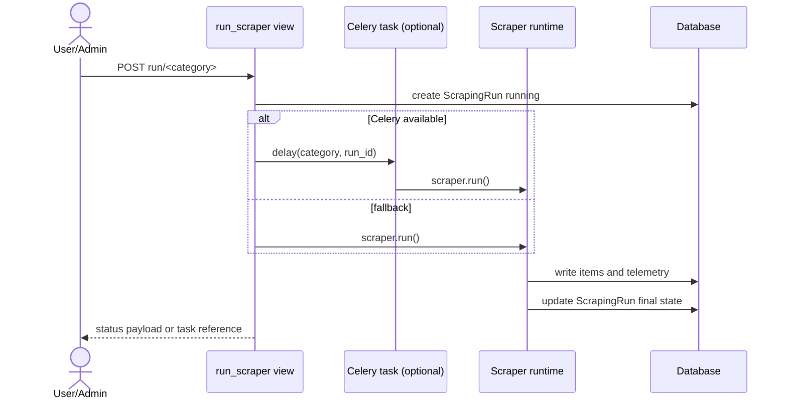
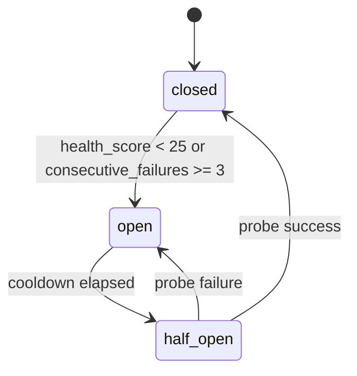
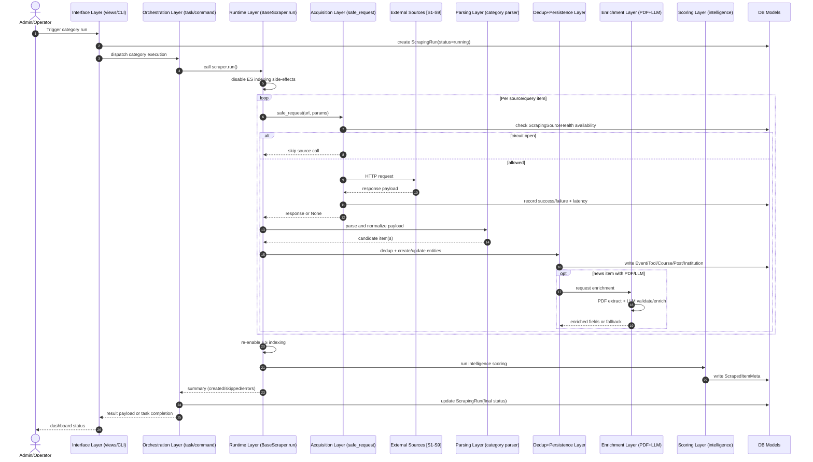
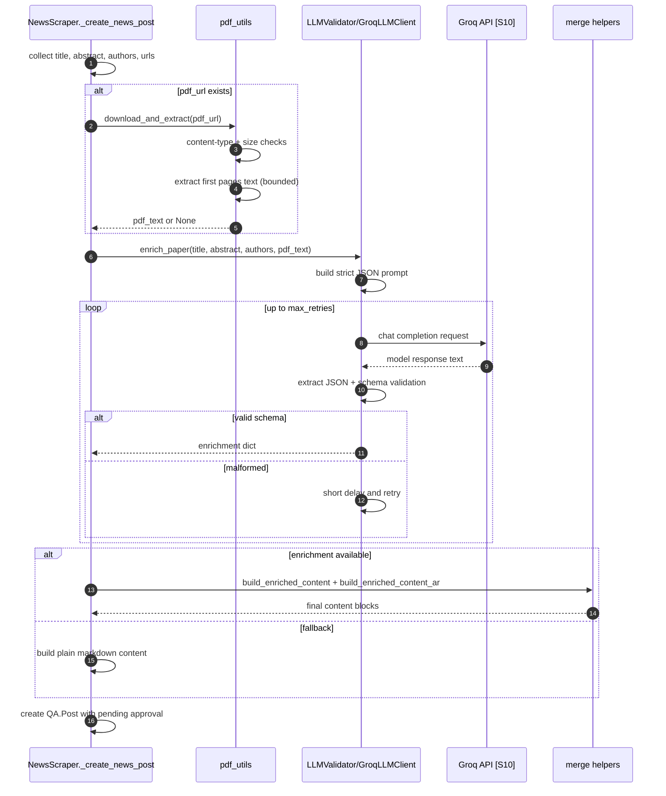
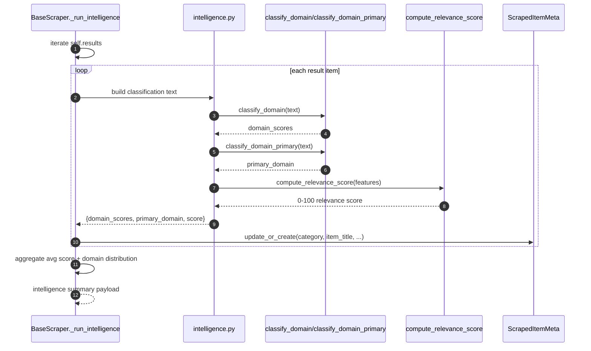

# Scraping Module Research Report

## Title
Web Scraping and Enrichment Architecture for an Arabic NLP Platform: Full Pipeline, Source Inventory, and PDF Parsing Strategy

## Abstract
This report analyzes the scraping subsystem as a production ingestion architecture rather than a standalone crawler script set. The system combines multi-source extraction, retry and circuit-breaker resilience, schema mapping into domain models, moderation-safe persistence, optional LLM enrichment, and post-run relevance scoring. We provide formal methodology, results, discussion, limitations, and conclusion sections. We also include citation-style source tables and figure-captioned architecture diagrams. Finally, we present an applied PDF-ingestion analysis, using the user-provided yanis-2.pdf as inspiration for extraction quality requirements.

## Introduction
Modern NLP platforms require continuous ingestion of conferences, tools, papers, courses, and institutions from heterogeneous web sources. In this codebase, the scraping subsystem serves as a domain-focused ETL and enrichment layer for Arabic NLP. The key research question is whether this subsystem is architecturally sound for operational use and extensible for higher-quality document understanding.

This report addresses:

1. What external websites and APIs are used and how.
2. How the full pipeline executes from trigger to stored entities.
3. How resilience and quality controls are implemented.
4. How PDF parsing is currently done and how to improve it.

## Methodology

### Code analysis procedure
The analysis was conducted by static inspection of the scraping module implementation files:

- orchestration: views, tasks, management command,
- runtime abstraction: base scraper,
- concrete scrapers: events, tools, news, courses, institutions,
- enrichment and scoring: LLM validation and intelligence modules,
- PDF utility layer and data models.

### Scope boundaries
The report evaluates the scraping subsystem design and pipeline behavior. It does not evaluate external API business terms, legal compliance per source, or runtime benchmarks on live network traffic.

### Citation style
Operational sources are indexed as Source IDs in the form [S1], [S2], etc., and listed in citation-style tables below.

### Source citation table (operational endpoints)

| Source ID | Endpoint | Category | Role in pipeline |
|---|---|---|---|
| [S1] | http://www.wikicfp.com/cfp/servlet/tool.search | events | Conference discovery via HTML search |
| [S2] | https://conferencealerts.co.in/{country} | events | Country-level conference pages |
| [S3] | https://www.allconferencealert.com/algeria.html | events | Algeria conference listing fallback |
| [S4] | https://huggingface.co/api/models | tools | Model metadata retrieval |
| [S5] | http://export.arxiv.org/api/query | news | Atom feed retrieval for papers |
| [S6] | https://api.semanticscholar.org/graph/v1/paper/search | news | Additional paper metadata retrieval |
| [S7] | https://api.learn.mit.edu/api/v1/courses/ | courses | MIT course search endpoint |
| [S8] | https://api.ror.org/organizations | institutions | Institution registry lookup |
| [S9] | https://api.openalex.org/institutions | institutions | Scholarly institution search |
| [S10] | https://api.groq.com/openai/v1/chat/completions | enrichment | LLM validation and paper enrichment |

### Source citation table (seed/reference URLs)

| Group ID | Group | Examples | Operational mode |
|---|---|---|---|
| [R1] | Curated event websites | ACL, EMNLP, NeurIPS, WANLP | Stored as reference links in created records |
| [R2] | Curated course links | Coursera, YouTube playlists | Inserted as course metadata |
| [R3] | Curated tool links | HuggingFace model/dataset pages | Inserted as tool metadata |
| [R4] | Curated institution websites | Universities and labs | Inserted as institution metadata |

## Results

### System architecture findings

1. The subsystem is layered and registry-driven.
2. Execution supports dashboard, Celery task, and CLI triggers.
3. Core runtime logic is centralized in the base scraper abstraction.
4. Post-ingestion intelligence scoring is applied across categories.
5. Moderation safety is enforced through pending approval status.

### Layer-by-layer operation model (full explanation)

The subsystem operates as a stacked pipeline. Each layer has a specific contract and input/output boundary.

| Layer | Primary components | Input | Output | How it works |
|---|---|---|---|---|
| L1 Interface layer | `views.py`, dashboard AJAX, CLI command | Admin action or scheduled trigger | Category run request | Validates permissions/category, creates run context, selects async or sync execution |
| L2 Orchestration layer | `tasks.py`, management command | Category + run identifiers | Executed scraper job | Resolves scraper class from registry and manages lifecycle status transitions |
| L3 Runtime control layer | `BaseScraper.run()` | Scraper instance | Structured run summary | Disables ES indexing side effects, executes scrape, restores state, triggers intelligence step |
| L4 Acquisition layer | `safe_request`, source-specific fetchers | URLs and query params | Raw HTML/XML/JSON/PDF bytes | Applies timeout, retries, backoff, and source-health checks before accepting responses |
| L5 Parsing and normalization layer | scraper-specific parsing methods | Raw source payload | Canonical item fields | Extracts fields, normalizes date/text/types/language tags, builds model-ready dictionaries |
| L6 Dedup and persistence layer | category `*_create_*` methods | Canonical item fields | Saved domain records | Performs duplicate checks, resolves related entities (institution/country/system user), persists pending items |
| L7 Enrichment layer (optional) | `pdf_utils.py`, `llm_validation.py` | Paper metadata and optional PDF text | Enriched text and metadata | Extracts bounded PDF text, sends schema-constrained prompt to LLM, merges validated fields |
| L8 Intelligence/scoring layer | `intelligence.py`, `_run_intelligence` | Created result items | `ScrapedItemMeta` rows and score summaries | Classifies domain with ontology regexes, computes relevance score, stores ranking metadata |
| L9 Observability and health layer | `ScrapingRun`, `ScrapingSourceHealth`, admin views | Request outcomes and latencies | Run telemetry and source-state history | Tracks run success/failure, error traces, source reliability state machine, dashboard/admin visibility |

Layer interaction principle:

1. Each layer consumes only the minimal artifacts it needs.
2. Non-critical layer failures degrade gracefully and do not crash the whole run.
3. Control-plane state (`ScrapingRun`, source health) is persisted independently of payload-level success.

### Figure 1: End-to-end scraping pipeline architecture

```mermaid
flowchart LR
   A[Admin Dashboard or CLI] --> B[Trigger run]
   B --> C[ScrapingRun status=running]
   C --> D[Registry get_scraper(category)]
   D --> E[BaseScraper.run]
   E --> F[Disable ES indexing]
   F --> G[Concrete scrape execution]
   G --> H[External sources APIs and HTML]
   G --> I[Create domain entities]
   I --> J[Enable ES indexing]
   J --> K[Intelligence scoring]
   K --> L[ScrapedItemMeta]
   L --> M[ScrapingRun completed or failed]
```

### Figure 2: Request and orchestration sequence



### Figure 3: Source health circuit-breaker states



### Figure 4: Full end-to-end runtime sequence (all layers)



### Figure 5: LLM enrichment internal sequence



LLM-layer behavior explanation:

1. It is optional and fail-open by design.
2. Prompt contracts force a strict JSON schema to reduce parsing ambiguity.
3. Retry logic addresses malformed model outputs, not only network errors.
4. Merging is controlled to avoid overwriting trusted source data unless explicitly allowed.

### Figure 6: Scoring and metadata internal sequence



Scoring-layer behavior explanation:

1. Domain detection is rule-based and ontology-backed for deterministic behavior.
2. Relevance score is multi-signal fusion with fixed weights.
3. Popularity uses logarithmic scaling to control heavy-tail dominance.
4. Metadata persistence is independent from domain-entity persistence, enabling re-scoring without rewriting source records.

### Quantitative and algorithmic findings

- Retry backoff in shared request primitive:

$$
sleep_k = \min(B \cdot 2^{k-1}, B_{max})
$$

with defaults $B=2$, $B_{max}=60$.

- Circuit breaker trip rule:

$$
open = (health\_score < 25) \lor (consecutive\_failures \ge 3)
$$

- Response-time smoothing uses EMA:

$$
EMA_t = 0.7 \cdot EMA_{t-1} + 0.3 \cdot x_t
$$

- Relevance score is weighted linear fusion over recency, relevance, health, popularity, and completeness.

### PDF parsing results (current implementation)

Pipeline observed in code:

1. PDF URL extracted from paper metadata (news flow, mainly arXiv).
2. `download_pdf` validates type and size (20 MB max).
3. `extract_text` reads first 3 pages with PyMuPDF.
4. Text truncated to 12,000 characters.
5. LLM enrichment prompt uses first 8,000 characters.

For yanis-2.pdf-inspired constraints, this approach is stable but conservative in semantic depth.

## Discussion

### Strengths

- Clear architectural separation between extraction, persistence, and scoring.
- Registry + base-class design improves maintainability.
- Failure-tolerant behavior is strong: fallback execution and non-blocking enrichment.
- Source health tracking adds production-grade resilience.
- Domain coverage is strong for Arabic NLP through curated regional sources.

### Weaknesses

- Some custom request paths (notably Semantic Scholar helper) do not fully reuse shared source-health instrumentation.
- Duplicate detection is mostly exact-match based, so near-duplicates may pass.
- HTML selectors in event scraping are brittle to upstream layout changes.
- Query generation intelligence exists but is not fully wired into all scrapers.

### PDF strategy interpretation
Current design optimizes for throughput and robustness, not maximal document understanding. For research-quality extraction, section-aware chunking and provenance-aware storage should be added.

## System Evaluation

This section defines how to evaluate the scraping subsystem as an engineering system and as an information-ingestion system.

### 1. Evaluation dimensions

Evaluate across five dimensions:

1. Coverage: how much relevant content is discovered.
2. Correctness: how accurate parsed and stored fields are.
3. Freshness: how quickly new external content appears in the platform.
4. Reliability: how stable runs are under network/API failures.
5. Efficiency: how much compute/time is required per created item.

### 2. Core KPIs

| Dimension | KPI | Definition |
|---|---|---|
| Coverage | Source Recall@N | Fraction of known relevant items retrieved from top N source results |
| Coverage | Category Yield | Created items per run and per category |
| Correctness | Field Accuracy | Percent of fields matching manual ground truth (title/date/url/type) |
| Correctness | Dedup Precision | Fraction of skipped items that are true duplicates |
| Correctness | Dedup Recall | Fraction of true duplicates successfully skipped |
| Freshness | Ingestion Lag | Time between source publication and local creation timestamp |
| Reliability | Run Success Rate | Completed runs / total runs |
| Reliability | Source Availability | Successful source calls / total source calls |
| Reliability | Circuit Recovery Time | Time from open state to stable closed state |
| Efficiency | Throughput | Created items per minute |
| Efficiency | Cost per Item | Runtime or API-token cost per created item |

### 3. Metric formulas

Standard classification metrics for quality checks:

$$
Precision = \frac{TP}{TP + FP}
$$

$$
Recall = \frac{TP}{TP + FN}
$$

$$
F1 = 2 \cdot \frac{Precision \cdot Recall}{Precision + Recall}
$$

Operational reliability metric:

$$
Run\ Success\ Rate = \frac{Completed\ Runs}{Total\ Runs}
$$

Freshness metric:

$$
Ingestion\ Lag = created\_at - source\_published\_at
$$

### 4. Offline evaluation protocol

Use a sampled benchmark set per category:

1. Build a gold set from manually verified items (events, tools, papers, courses, institutions).
2. Run scrapers over a fixed time window.
3. Compare output against gold set for coverage and field correctness.
4. Audit duplicate decisions (created vs skipped) to compute dedup precision/recall.
5. For news PDFs, evaluate extraction quality on section capture (title/abstract/method/results/conclusion presence).

Recommended sample size:

- minimum 100 manually labeled items per category for stable error estimates,
- stratify by source to avoid single-source bias.

### 5. Online production evaluation protocol

Use ongoing telemetry from `ScrapingRun`, `ScrapingSourceHealth`, and moderation workflow:

1. Monitor daily run success and failure causes.
2. Monitor per-source health trajectories and circuit-open frequency.
3. Track moderation outcomes (`approved`, `edited`, `rejected`) as quality proxy.
4. Alert on sudden drops in category yield or spikes in skipped/failed counts.
5. Track ingestion lag weekly for recency-sensitive categories (especially news/events).

### 6. Evaluation of PDF parsing quality

For paper ingestion, add PDF-specific KPIs:

| KPI | How to measure |
|---|---|
| Text Extraction Success Rate | PDFs with non-empty extracted text / attempted PDFs |
| Section Coverage | Fraction of expected sections detected in extracted text |
| Enrichment Utility | Fraction of posts where enrichment adds non-empty summary/keywords/domain |
| Hallucination Rate | Fraction of enrichment fields unsupported by source text during audit |

Practical evaluation method:

1. Randomly sample enriched posts with PDFs.
2. Perform human verification against original paper text.
3. Score summary fidelity and keyword relevance (e.g., 1-5 rubric).
4. Track trend over time after parser/enrichment changes.

### 7. Acceptance thresholds (initial)

Use these as initial engineering targets:

- Run success rate >= 95% weekly.
- Field accuracy >= 90% on audited samples.
- Dedup F1 >= 0.90.
- PDF extraction success >= 85% for reachable PDFs.
- Median ingestion lag <= 72 hours for news.

Thresholds should be tuned per source volatility and category behavior.

### 8. Experimentation plan for improvements

When implementing parser or ranking changes, run A/B style comparisons:

1. Baseline: current production logic.
2. Variant: proposed change (for example section-aware PDF chunking).
3. Compare KPIs over same time window and source mix.
4. Promote only if quality gains are statistically and operationally meaningful.

## Limitations

1. This report is static analysis of implementation and not a live benchmark under production traffic.
2. The attached PDF was treated as inspiration and metadata-level evidence, not as a full workspace artifact for complete extraction evaluation.
3. API rate limits and response shape changes may affect observed behavior outside this analysis window.
4. No external legal assessment of terms-of-service per source was performed.

## Conclusion
The scraping module is a credible ingestion subsystem with strong operational foundations: layered architecture, multi-trigger orchestration, resilience controls, optional enrichment, and post-run intelligence metadata. Its primary future gain is not structural redesign but quality depth: better near-duplicate handling, tighter observability consistency across all request paths, and section-aware PDF understanding.

For a next implementation phase, prioritize:

1. section-aware PDF chunk extraction and provenance,
2. chunk-level LLM summarization/enrichment,
3. structured research-entity persistence (methods, datasets, metrics, claims),
4. harmonized source-health tracking for every external request path.
