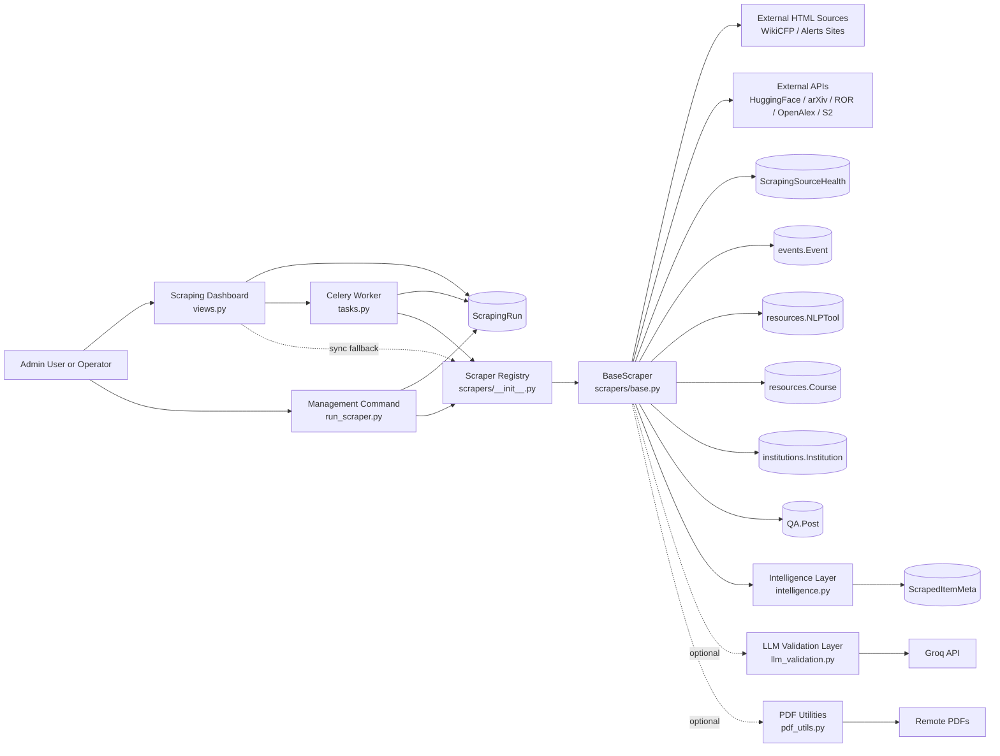
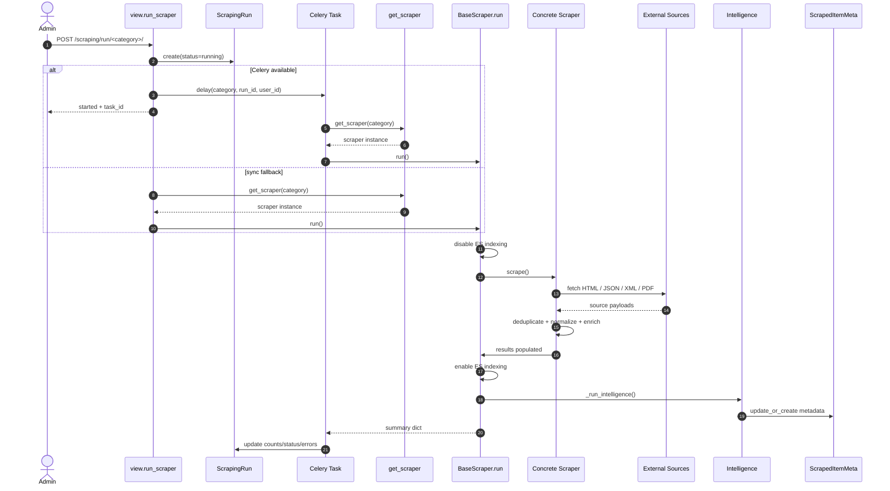
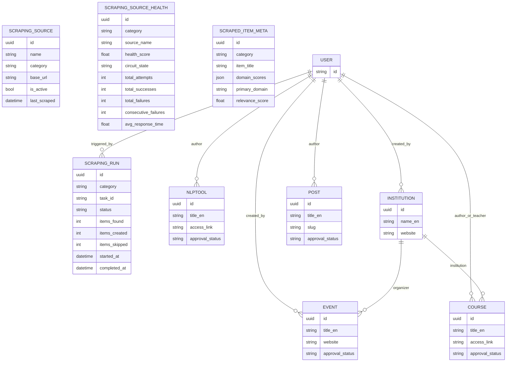
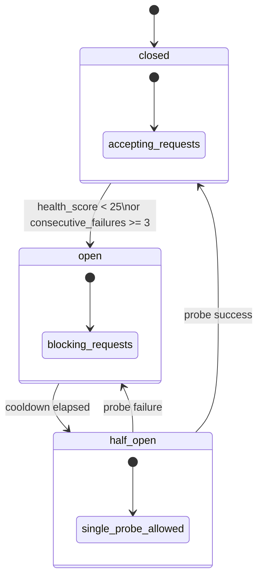

# Scraping Module System Design Analysis

## 1. Scope and intent

This document analyses the Django `scraping` app as it exists in code, not just as described in the local README. The goal is to explain:

- how the scraping subsystem is structured end to end,
- what each file, class, and function is responsible for,
- what algorithms and mathematical ideas appear in the implementation,
- what theoretical design patterns are being used,
- and what architectural inconsistencies or risks are present.

The module is not only a set of web scrapers. It is a small ingestion platform with:

- orchestration through views, Celery tasks, and a management command,
- source reliability tracking through a circuit breaker,
- optional LLM-based enrichment,
- item scoring and trend detection,
- and persistence into multiple domain apps such as `events`, `resources`, `institutions`, and `QA`.

## 2. Executive summary

At a system-design level, the scraping app implements a layered ingestion pipeline:

1. A caller triggers a scrape through the admin dashboard, a Celery task, or `manage.py run_scraper`.
2. A category key such as `events` or `news` is resolved through a registry.
3. A concrete scraper subclass runs through the `BaseScraper` template method.
4. The scraper pulls data from external APIs or HTML pages using fault-tolerant HTTP helpers.
5. Candidate items are deduplicated and mapped into first-class Django models.
6. The base layer computes domain metadata and relevance scores after the scrape completes.
7. Run-level and source-level telemetry are persisted for observability and trend analysis.

This is a hybrid architecture. Part of it is operational scraping, part of it is data quality control, and part of it is lightweight information retrieval / intelligence.

## 3. High-level architecture

### 3.1 Main components

- Presentation layer: `views.py`, dashboard, AJAX endpoints, task polling.
- Application orchestration layer: `tasks.py`, `management/commands/run_scraper.py`.
- Domain model layer: `models.py`.
- Scraper runtime layer: `scrapers/base.py` plus concrete scrapers.
- Intelligence layer: `intelligence.py` and `llm_validation.py`.
- Utility layer: `pdf_utils.py`.
- Configuration and wiring: `apps.py`, `urls.py`, `admin.py`, `scrapers/__init__.py`.

### 3.2 Runtime sequence

```text
Admin UI / CLI / Celery beat
        |
        v
run_scraper view OR run_scraper_task OR management command
        |
        v
registry: get_scraper(category)
        |
        v
BaseScraper.run()
  - disable ES indexing
  - call concrete scrape()
  - re-enable ES indexing
  - run intelligence scoring
        |
        v
Create domain records in other apps
  - Event
  - NLPTool
  - Course
  - Institution
  - QA.Post
        |
        v
Persist telemetry
  - ScrapingRun
  - ScrapingSourceHealth
  - ScrapedItemMeta
```

### 3.3 Drawn system design

The following Mermaid diagrams turn the architecture into an executable visual specification. In VS Code Markdown preview, these blocks can be rendered directly.

#### 3.3.1 Component architecture



#### 3.3.2 Request and execution sequence



#### 3.3.3 Data model and persistence map



#### 3.3.4 Source health circuit-breaker state machine



#### 3.3.5 Category-specific ingestion topology

```mermaid
flowchart TD
  START[Trigger category scraper] --> CAT{Category}

  CAT --> E[Events]
  CAT --> T[Tools]
  CAT --> N[News]
  CAT --> C[Courses]
  CAT --> I[Institutions]

  E --> E1[WikiCFP HTML]
  E --> E2[ConferenceAlerts HTML]
  E --> E3[AllConferenceAlert HTML]
  E --> E4[Curated conference set]
  E --> EO[Create Event + Organizer Institution]

  T --> T1[HuggingFace model API]
  T --> T2[Curated Arabic LLMs]
  T --> T3[Curated datasets]
  T --> TO[Create NLPTool]

  N --> N1[arXiv Atom API]
  N --> N2[Semantic Scholar API]
  N --> N3[Optional PDF download]
  N --> N4[Optional LLM paper enrichment]
  N --> NO[Create QA.Post]

  C --> C1[MIT Open Learning API]
  C --> C2[Curated Coursera catalog]
  C --> C3[Curated YouTube playlists]
  C --> C4[Curated university courses]
  C --> CO[Create Course]

  I --> I1[ROR API]
  I --> I2[OpenAlex API]
  I --> I3[Curated Algerian institutions]
  I --> I4[Curated African and Arab labs]
  I --> I5[Curated North African and Gulf institutions]
  I --> IO[Create Institution]

  EO --> END[Intelligence scoring + telemetry]
  TO --> END
  NO --> END
  CO --> END
  IO --> END
```



### 3.4 Design patterns in use

- Template Method: `BaseScraper.run()` defines the stable execution skeleton while subclasses fill in `scrape()`.
- Registry Pattern: `scrapers/__init__.py` maps category strings to concrete classes.
- Circuit Breaker: `ScrapingSourceHealth` blocks unstable upstream sources.
- Graceful Degradation: Celery falls back to synchronous execution; LLM enrichment fails open; PDF extraction is optional.
- Lightweight ETL: extract from sources, transform fields, load into domain tables.
- Post-processing pipeline: intelligence scoring runs after ingestion rather than inside each scraper.

## 4. Current implementation versus README

One important architectural fact: `scraping/README.md` is partially stale.

- The README describes synchronous execution as the main mode.
- The current code supports asynchronous execution through Celery in `tasks.py` and `views.py`.
- The README does not reflect the source health model, circuit breaker logic, or `ScrapedItemMeta` intelligence layer.
- The actual scraper base class is more advanced than the README suggests, especially around retry logic and telemetry.

For design decisions, the code should be treated as authoritative.

## 5. File-by-file analysis

### 5.1 `apps.py`

#### `ScrapingConfig`

Role:
- Registers the Django app under the name `scraping`.
- Supplies the admin-visible app name `Web Scraping`.

Theory:
- This is pure framework configuration. No algorithmic content and no meaningful math are present.

### 5.2 `urls.py`

Role:
- Exposes four entry points:
  - dashboard page,
  - run scraper endpoint,
  - task status endpoint,
  - trends endpoint.

Theory:
- This is interface routing. It defines the public contract between the browser and the application layer.
- No computational math exists here.

### 5.3 `views.py`

This file is the synchronous HTTP orchestration layer.

#### `is_admin(user)`

Role:
- Allows staff or superusers into scraping endpoints.

Theory:
- Boolean access-control predicate.
- No non-trivial math.

#### `dashboard(request)`

Role:
- Builds dashboard state for every category.
- Loads last run and recent runs per category.
- Aggregates total run counts and created-item counts.
- Queries target models from other apps to display actual item totals and pending moderation counts.

How it works:
- Iterates over `get_all_categories()`.
- For each category, reads `ScrapingRun` history.
- Queries `Event`, `NLPTool`, `Course`, `Institution`, and `QA.Post` for current inventory counts.

Theory:
- This is read-model assembly: it constructs a dashboard projection from multiple tables.
- `total_created = sum(r.items_created for r in ScrapingRun.objects.all())` is a simple aggregate over historical runs.

#### `run_scraper(request, category)`

Role:
- Main trigger endpoint.
- Validates category.
- Creates a `ScrapingRun` record.
- Tries to dispatch a Celery task.
- Falls back to in-process execution if Celery is unavailable.

Design significance:
- This function is the bridge between request-response UX and background processing.
- It uses fail-open degradation: asynchronous first, synchronous second.

Theory:
- This is a two-stage availability strategy:
  - preferred mode: async distributed execution,
  - fallback mode: local execution to preserve user functionality.

#### `task_status(request, run_id)`

Role:
- Polls the current state of a run.
- Returns counts and duration.
- If complete and a Celery backend is present, tries to pull the stored result payload.

Theory:
- Implements eventual consistency at the UI layer.
- The browser does not wait for the scrape; it polls the persisted state until completion.

#### `trends(request)`

Role:
- Exposes trend analysis from `scraping.intelligence.detect_trends`.

Theory:
- Thin API façade over an analytics function.

### 5.4 `tasks.py`

This file provides the background execution path.

#### `run_scraper_task(self, category, run_id=None, user_id=None)`

Role:
- Celery entry point for asynchronous scraping.
- Resolves or creates `ScrapingRun`.
- Stores the current Celery task ID.
- Executes the concrete scraper.
- Writes final counts and errors.

Theory:
- This is durable orchestration. The task ID lets the UI correlate a long-running job with a persistent run row.
- The task returns a result object, but the durable source of truth is the database row.

### 5.5 `models.py`

This file contains the operational telemetry model and the intelligence metadata model.

#### `ScrapingSource`

Role:
- Stores configurable source definitions per category.
- It is mostly descriptive metadata for sources rather than the central runtime mechanism.

Fields of note:
- `category`, `base_url`, `is_active`, `last_scraped`.

Theory:
- Static source catalog.
- No non-trivial math.

#### `ScrapingRun`

Role:
- One row per scraping execution.
- Tracks category, async task ID, status, item counts, errors, timing, and triggering user.

#### `ScrapingRun.duration`

Role:
- Returns run duration in seconds if completion time exists.

Math:

$$
duration = (completed\_at - started\_at).total\_seconds()
$$

This is a simple elapsed-time calculation.

#### `ScrapingSourceHealth`

Role:
- Encodes source-level reliability, performance history, and circuit-breaker state.

This is one of the most important design pieces in the module.

Tracked state:
- total attempts,
- successes and failures,
- consecutive failures,
- health score,
- circuit state,
- timestamps,
- average response time,
- last error.

Constants:
- `FAILURE_PENALTY = 15.0`
- `SUCCESS_RECOVERY = 10.0`
- `CIRCUIT_THRESHOLD = 25.0`
- `CONSECUTIVE_TRIP = 3`

#### `record_success(response_time=None)`

Role:
- Updates counters on success.
- Resets consecutive failures.
- Increases health score.
- Updates average response time with exponential smoothing.
- Closes a half-open circuit after a successful probe.

Math:

Health recovery:

$$
health\_score = \min(100, health\_score + 10)
$$

Exponential moving average for response time:

$$
EMA_t = 0.7 \cdot EMA_{t-1} + 0.3 \cdot x_t
$$

This weights historical latency more than the newest observation, which stabilizes noisy latency samples.

#### `record_failure(error="")`

Role:
- Increments failure counters.
- Decreases health score.
- Opens or re-opens the circuit when the source becomes unreliable.

Math:

Health decay:

$$
health\_score = \max(0, health\_score - 15)
$$

Trip condition:

$$
open = (health\_score < 25) \lor (consecutive\_failures \ge 3)
$$

This is threshold-based reliability control.

#### `is_available()`

Role:
- Implements the circuit-breaker state machine.

State semantics:
- `closed`: requests allowed.
- `open`: requests blocked until cooldown expires.
- `half_open`: one probe attempt is allowed.

Math:

Let

$$
elapsed = now - circuit\_opened\_at
$$

If `elapsed >= circuit_cooldown_seconds`, the state moves from `open` to `half_open`.

This is a time-gated recovery mechanism.

#### `ScrapedItemMeta`

Role:
- Stores intelligence output per scraped item.
- Persists domain score maps, the primary domain label, and a composite relevance score.

Theory:
- This model separates ingestion from ranking metadata, which is a clean design choice. The business entity and the scoring artifact are not conflated.

### 5.6 `admin.py`

This file is an observability surface for humans.

#### `ScrapingSourceAdmin`

Role:
- Displays source configuration and category badges.

#### `category_badge(self, obj)`

Role:
- Maps category to a color-coded HTML badge.

Theory:
- UI encoding of a finite-state category variable.
- No business math.

#### `ScrapingRunAdmin`

Role:
- Displays run results, statuses, and durations.

#### `status_badge(self, obj)`

Role:
- Maps status to a colored badge.

#### `duration_display(self, obj)`

Role:
- Renders duration in seconds using one decimal place.

#### `ScrapingSourceHealthAdmin`

Role:
- Makes the circuit-breaker and source-health mechanics visible.

#### `health_bar(self, obj)`

Role:
- Renders `health_score` as a percentage bar.

Math:
- The width is proportional to `min(score, 100)` percent.
- This is a direct linear mapping from score in `[0, 100]` to display width in `[0, 100]%`.

#### `circuit_badge(self, obj)`

Role:
- Renders `closed`, `open`, or `half_open` in human-readable form.

#### `avg_response_display(self, obj)`

Role:
- Displays latency with two decimals.

#### `ScrapedItemMetaAdmin`

Role:
- Displays ranking metadata and domain labels.

#### `item_title_short(self, obj)`

Role:
- Truncates long titles for list display.

#### `score_badge(self, obj)`

Role:
- Color-codes relevance score bands.

### 5.7 `scrapers/__init__.py`

This file is the category registry.

#### `SCRAPERS`

Role:
- Static mapping from category key to concrete scraper class.

#### `CATEGORY_META`

Role:
- Declares UI metadata for each category, including labels, icons, colors, descriptions, and source names.

#### `get_scraper(category)`

Role:
- Returns a fresh scraper instance.
- Raises a `ValueError` for unknown categories.

Theory:
- This is a factory-like function over a registry dictionary.

#### `get_all_categories()`

Role:
- Preserves display order by iterating keys in registry order.

### 5.8 `scrapers/base.py`

This is the core runtime abstraction. It contains the main operational intelligence of the subsystem.

#### `BaseScraper`

Role:
- Provides the common protocol for all concrete scrapers.
- Owns results, errors, a persistent HTTP session, retry logic, source health tracking, system-user resolution, and post-run intelligence.

#### `__init__(self)`

Role:
- Initializes counters, error lists, health cache, and a `requests.Session`.
- Sets common headers and rotates the initial User-Agent.

Theory:
- Shared session reuse reduces connection overhead and supports consistent scraping behavior.

#### `scrape(self)`

Role:
- Abstract method implemented by subclasses.

Theory:
- Template Method hook.

#### `run(self)`

Role:
- Full execution skeleton:
  - disable Elasticsearch indexing,
  - execute concrete scraping logic,
  - re-enable indexing,
  - run intelligence scoring,
  - return a summary dictionary.

Theory:
- This is the exact point where operational concerns are centralized instead of repeated in each scraper.

#### `_disable_es_indexing(self)` / `_enable_es_indexing(self)`

Role:
- Monkey-patch `django_elasticsearch_dsl` registry update/delete methods to no-op during bulk ingestion.

Theory:
- This is a side-effect isolation strategy. The scraper avoids synchronous indexing pressure while creating many records.

#### `get_system_user(self)`

Role:
- Returns or creates the dedicated system user used as author/creator.

Design note:
- It uses `bulk_create` specifically to avoid post-save side effects.

#### `get_or_create_country(...)`

Role:
- Returns an `institutions.Country`, defaulting the code from the first two uppercase characters of the English name.

Math:
- String truncation and uppercase normalization only.

#### `get_or_create_institution(...)`

Role:
- Resolves an institution or creates a generic one from partial metadata.
- Builds address and description fallback strings.

Theory:
- This is identity resolution with heuristic defaults.

#### `_rotate_user_agent(self)`

Role:
- Randomly chooses one User-Agent string from the pool.

Math:
- Uniform random selection over a finite set.

#### `safe_request(...)`

Role:
- Central network primitive for scrapers.
- Adds timeout defaults, retry logic, backoff, 429 handling, 5xx handling, latency tracking, and circuit-breaker integration.

This is the most important operational function in the runtime.

Algorithm:

1. Resolve `source_name`.
2. Check source availability through circuit breaker.
3. Retry up to `MAX_RETRIES`.
4. Rotate User-Agent on every attempt.
5. Measure elapsed time.
6. On success, report success and return the response.
7. On repeated failure, report failure and return `None`.

Math:

Standard exponential backoff:

$$
sleep_k = \min(B \cdot 2^{k-1}, B_{max})
$$

where:

- $B = 2.0$ seconds,
- $B_{max} = 60.0$ seconds,
- $k$ is the attempt number.

For rate limiting, the function uses:

$$
sleep = \max(RetryAfter + 2, sleep_k)
$$

This ensures the scraper respects upstream advice while still applying a minimum retry growth policy.

Latency measurement:

$$
elapsed = monotonic(t_{end}) - monotonic(t_{start})
$$

Using a monotonic clock avoids wall-clock discontinuity problems.

#### `_get_health(self, source_name, base_url="")`

Role:
- Caches and lazily creates `ScrapingSourceHealth` rows.

Theory:
- In-memory identity map for the duration of a scrape run.

#### `check_source(...)`, `report_success(...)`, `report_failure(...)`

Role:
- Thin adapters to the health model.

#### `_log_error(...)`

Role:
- Builds a structured error record and logs it.

Theory:
- This produces machine-readable telemetry rather than plain strings only.

#### `parse_date(date_str, default=None)`

Role:
- Best-effort natural-language date parser using `dateutil` with fuzzy parsing.

Theory:
- Converts messy text to normalized date objects.
- This is heuristic parsing, not deterministic schema parsing.

#### `truncate(text, max_len=200)`

Role:
- Protects dashboard/result payloads from very long fields.

Math:
- Length clamping to `max_len - 3` plus ellipsis.

#### `clean_text(text)`

Role:
- Collapses repeated whitespace with a regular expression.

Theory:
- Normalization preprocessing.

#### `_run_intelligence(self)`

Role:
- Post-processes `self.results` into domain scores and relevance scores.
- Stores or updates `ScrapedItemMeta` rows.

Algorithm:

1. Build classification text from title, description, and type.
2. Run domain classification.
3. Select the primary domain.
4. Compute a composite score.
5. Persist metadata.
6. Return aggregate intelligence summary.

Math:
- Uses `compute_relevance_score()` from `intelligence.py`.
- Average score is:

$$
avg = \frac{\sum score_i}{\max(n, 1)}
$$

### 5.9 `scrapers/events.py`

This scraper combines HTML scraping, curated data, organizer resolution, and optional LLM validation.

#### `CONFERENCE_ORGS`

Role:
- Mapping from conference acronym to organizer institution metadata.

#### `CURATED_EVENTS`

Role:
- Fallback and strategic seed corpus of well-known NLP events.

Theory:
- This is a curated prior. It guarantees baseline coverage even if upstream sources fail.

#### `EventScraper.scrape(self)`

Role:
- Runs a sequence of acquisition strategies:
  - WikiCFP,
  - country-specific ConferenceAlerts scraping,
  - Algeria-specific AllConferenceAlert scraping,
  - curated events import.

Theory:
- Multi-source fusion with fallback.

#### `_scrape_wikicfp(self)`

Role:
- Sends three separate queries to WikiCFP and parses alternating table rows.

Algorithm:
- Query search page.
- Parse row pairs where one row has title metadata and the next carries dates and location.
- Convert date string to start/end dates.
- Call `_create_event`.

Theory:
- Semi-structured HTML parsing. It relies on positional table conventions rather than a true public API.

#### `_scrape_conferencealerts_country(self, country)`

Role:
- Generic country scraper for `conferencealerts.co.in`.
- Uses regex to extract dates and city hints from mixed text.

Math:
- Regex acts as a pattern recognizer over noisy unstructured text.

#### `_scrape_conferencealerts_algeria(self)`

Role:
- Specialized version for Algeria.

Design note:
- There is duplication between this method and `_scrape_conferencealerts_country`. A future refactor could consolidate them.

#### `_scrape_allconferencealert_algeria(self)`

Role:
- Scrapes another Algerian event source with a slightly different table format.

#### `_import_curated_events(self)`

Role:
- Loads curated seed events directly.

#### `_create_event(...)`

Role:
- Deduplicates, resolves organizer, optionally validates via LLM, and writes `Event` rows.

Algorithm:

1. Require a start date.
2. Skip duplicates by exact title or website URL.
3. Resolve organizer institution.
4. Optionally call `validate_item`.
5. If the LLM flags spam or irrelevance, skip.
6. Merge translated and normalized fields.
7. Create the `Event` object.

Theory:
- This is the record materialization stage.
- The LLM does not own the pipeline; it acts as a non-blocking quality filter.

#### `_resolve_organizer(self, org_key)`

Role:
- Maps an event acronym to an organizer institution, otherwise falls back to a generic NLP community institution.

#### `_parse_date_range(self, text)`

Role:
- Splits a date range on hyphen-like separators and parses both sides.

### 5.10 `scrapers/tools.py`

This scraper is mostly API-driven and therefore structurally cleaner than the HTML scrapers.

#### `PIPELINE_MAP`

Role:
- Maps HuggingFace pipeline tags to internal platform tool types.

Theory:
- Controlled vocabulary projection from an external taxonomy into an internal taxonomy.

#### `LANG_MAP`

Role:
- Maps tag-level language markers to internal language codes.

#### `ToolScraper.scrape(self)`

Role:
- Executes many HuggingFace searches.
- Deduplicates by model ID.
- Processes API models.
- Imports curated models and datasets.

Theory:
- Query fan-out plus deduplication.

#### `_process_model(self, model)`

Role:
- Converts one HuggingFace API model entry into `resources.NLPTool`.

Algorithm:
- Extract identifiers, tags, downloads, likes, author, and pipeline type.
- Build a readable title from the model ID.
- Deduplicate by URL and exact title.
- Resolve internal tool type and supported language.
- Build a descriptive text payload.
- Persist the record.

Math:
- No advanced math beyond count formatting and direct mapping.
- Popularity metrics such as downloads and likes are captured for later scoring.

#### `_import_curated_llm_tools(self)`

Role:
- Seeds notable Arabic and multilingual models that may not be discoverable enough through generic search.

#### `_import_curated_datasets(self)`

Role:
- Treats datasets as discoverable NLP tools for the platform catalog.

### 5.11 `scrapers/news.py`

This scraper is the richest pipeline because it includes PDF extraction and academic summarization.

#### `NewsScraper.scrape(self)`

Role:
- Runs arXiv and Semantic Scholar import passes.

#### `_scrape_arxiv(self)`

Role:
- Calls the arXiv Atom API.
- Parses XML entries.
- Extracts title, summary, dates, authors, links, and categories.
- Creates news posts.

Theory:
- Structured XML ingestion.

#### `_scrape_semantic_scholar(self)`

Role:
- Runs a broader query against Semantic Scholar.
- Deduplicates on `paperId`.
- Sleeps between query batches to reduce rate-limit pressure.

Design note:
- This method bypasses `safe_request` and uses a custom request function `_s2_request`. That is reasonable because Semantic Scholar needs custom 429 logic, but it also means source health metrics are not reused here.

#### `_s2_request(self, params, max_retries=5)`

Role:
- Handles Semantic Scholar's rate limiting and gateway timeouts.

Math:
- Custom retry schedule:

$$
wait = \min(30 \cdot 2^{k-1}, 180)
$$

for 429 responses without `Retry-After`.

This sequence is `30, 60, 120, 180, 180` seconds.

#### `_create_news_post(...)`

Role:
- Materializes one paper as `QA.Post`.
- Optionally downloads PDF text.
- Optionally calls LLM paper enrichment.
- Builds Markdown content.
- Creates a unique slug.

Algorithm:

1. Skip duplicates by exact title.
2. If a PDF URL exists, try `download_and_extract`.
3. If LLM is available, call `enrich_paper`.
4. Build enriched English and Arabic content.
5. Generate a slug from title; fall back to ASCII or UUID fragment if needed.
6. Ensure slug uniqueness by suffixing `-1`, `-2`, ...
7. Create `QA.Post`.

Math:
- The uniqueness loop is a linear probe over candidate slugs.
- PDF extraction truncation is a bounded-resource strategy, not a mathematical model.

### 5.12 `scrapers/courses.py`

This scraper is primarily a catalog import pipeline with a small live API component.

#### `FIELD_MAP`

Role:
- Declares a text-to-field taxonomy, but in current code it is not actually used in `_create_course`.

Design note:
- This is latent design surface: the mapping exists but is not active.

#### `CURATED_COURSES`

Role:
- High-quality seed corpus of academic NLP courses.

#### `CourseScraper.scrape(self)`

Role:
- Runs MIT OCW scraping plus curated Coursera, YouTube, and university imports.

#### `_scrape_mit_ocw(self)`

Role:
- Queries the MIT Open Learning API for several search variants.
- Deduplicates by course ID.
- Resolves academic level from MIT run metadata.

#### `_scrape_coursera(self)`

Role:
- Imports curated Coursera offerings rather than scraping the live Coursera website.

#### `_import_youtube_playlists(self)`

Role:
- Treats curated YouTube educational series as course-like resources.

#### `_import_curated_courses(self)`

Role:
- Imports the static university course catalog.

#### `_create_course(...)`

Role:
- Deduplicates by exact title.
- Computes current academic year.
- Writes `resources.Course`.

Math:

$$
academic\_year = current\_year \; || \; "-" \; || \; (current\_year + 1)
$$

This is a simple time-derived label rather than an algorithmic score.

### 5.13 `scrapers/institutions.py`

This scraper mixes public research registries with curated regional coverage.

#### `TYPE_MAP`

Role:
- Projects external organization types into internal institution types.

#### `InstitutionScraper.scrape(self)`

Role:
- Runs ROR, OpenAlex, Algerian curated imports, African NLP labs, North African institutions, and Arabic/Gulf institutions.

Theory:
- This is multi-source institutional discovery with strong regional priors.

#### `_scrape_ror(self)`

Role:
- Queries ROR for several keywords and deduplicates by ROR ID.

#### `_process_ror_item(self, item)`

Role:
- Parses ROR v2 structures: names, locations, links, types.
- Builds a description and inferred contact email.
- Creates `Institution`.

Theory:
- Schema adaptation from external nested JSON into an internal relational schema.

#### `_scrape_openalex(self)`

Role:
- Queries OpenAlex institutions search and forwards results to the processing helper.

#### `_process_openalex_item(self, item)`

Role:
- Maps OpenAlex geo, type, homepage, acronym, and publication statistics into an institution record.

Math:
- Uses publication and citation counts as descriptive metadata.
- No composite computation is done inside the method.

#### `_import_algerian_universities(self)`

Role:
- Seeds curated Algerian institutions.

#### `_import_african_nlp_labs(self)`

Role:
- Seeds curated African and Arabophone NLP labs.

#### `_import_north_african_institutions(self)`

Role:
- Seeds regional North African institutions.

#### `_import_arabic_institutions(self)`

Role:
- Seeds Gulf and broader Arabic institutions.

Theory across curated import methods:
- These methods encode domain knowledge that generic registries may miss.
- The scraper is therefore not only a crawler; it is also a curated knowledge loader.

### 5.14 `intelligence.py`

This file is the ranking and analytics engine of the module.

#### `DOMAIN_ONTOLOGY`

Role:
- Knowledge base of English and Arabic terms for:
  - Arabic NLP,
  - Arabic linguistics,
  - speech processing,
  - LLM research.

Theory:
- A rule-based ontology acts as a compact expert system.

#### `_build_keyword_index()`

Role:
- Builds reverse lookup from keyword to domains.

Theory:
- Inverted index over ontology terms.

#### `expand_keywords(seed_terms, max_results=30)`

Role:
- Returns seed terms plus ontology expansions from matched domains.

Algorithm:
- Keep deduplicated seed terms.
- Resolve domains for seed terms.
- Pull related keywords from those domains.

Theory:
- Lightweight query expansion.
- Useful conceptually for recall improvement in search or API querying.

#### `generate_queries(category, max_queries=12, include_arabic=True)`

Role:
- Generates query dictionaries from base terms, modifiers, Arabic terms, and category-specific extras.

Math:
- Cartesian combination of base terms and modifiers, then truncation to `max_queries`.
- If there are `m` base terms and `n` modifiers, the maximum raw combination count is `m * n` before filtering.

#### `_build_domain_patterns()`

Role:
- Compiles one regex per domain from ontology keywords.

Design note:
- Keywords are sorted by descending length before regex assembly so longer phrases are tried earlier. This reduces some shorter-keyword shadowing.

#### `classify_domain(text)`

Role:
- Computes a rule-based domain-confidence dictionary.

Math:
- For each domain, let `u` be the number of unique matched keywords.
- The score is:

$$
score = \min(1.0, 0.3 + 0.15u)
$$

This is a capped affine function of the number of unique matches.

Interpretation:
- 1 unique match -> `0.45`
- 2 unique matches -> `0.60`
- 3 unique matches -> `0.75`
- 4 unique matches -> `0.90`
- 5 or more -> `1.00`

#### `classify_domain_primary(text)`

Role:
- Returns the max-scoring domain or `general`.

#### `classify_with_llm_fallback(text)`

Role:
- Intended to use rule-based classification first, then ask an LLM when scores are weak or absent.

Important implementation gap:
- It imports `_call_groq` from `scraping.llm_validation`, but that function does not exist in the current file.
- Therefore, the fallback path is effectively broken and silently swallowed by the `except` block.

Architectural implication:
- The design intent is sound, but the current implementation does not realize it.

#### `SCORING_WEIGHTS`

Role:
- Defines a weighted scoring model:
  - recency: `0.25`
  - relevance: `0.30`
  - source health: `0.15`
  - popularity: `0.15`
  - completeness: `0.15`

The weights sum to `1.0`, which is exactly what a normalized weighted average should do.

#### `compute_relevance_score(...)`

Role:
- Produces the module's central 0-100 ranking score.

Component math:

Recency piece:
- `1.0` if item is <= 30 days old.
- `0.85` if <= 90 days.
- `0.7` if <= 180 days.
- `0.5` if <= 365 days.
- Beyond 365 days, decays toward `0.1`.

Relevance piece:

$$
relevance = \max(domain\_scores) \quad \text{or} \quad 0.2 \text{ if none}
$$

Health piece:

$$
health = source\_health\_score / 100
$$

Popularity piece:

$$
pop\_raw = downloads + 10 \cdot citations + 5 \cdot likes
$$

$$
popularity = \min(1.0, \log(1 + pop\_raw) / 15)
$$

This is log scaling. It compresses very large popularity values so they do not dominate the score.

Completeness piece:

$$
completeness = \frac{has\_description + has\_website + has\_arabic + has\_text}{4}
$$

Final score:

$$
raw = 0.25R_c + 0.30R_l + 0.15H + 0.15P + 0.15C
$$

$$
final = round(100 \cdot raw, 1)
$$

where:
- $R_c$ is recency,
- $R_l$ is relevance,
- $H$ is health,
- $P$ is popularity,
- $C$ is completeness.

This is a linear multi-criteria scoring model.

#### `detect_trends(months=6)`

Role:
- Aggregates category counts, monthly activity, top sources, top domains, and growth topics over a recent window.

Algorithm:

1. Set cutoff at `now - months * 30 days`.
2. Aggregate completed runs and created items by category.
3. Aggregate monthly activity by `YYYY-MM`.
4. Read healthiest / most successful sources.
5. Count domain occurrences over recent items.
6. Compare first-half versus second-half topic counts.

Growth formula:

$$
growth\_pct = \frac{count_2 - count_1}{\max(count_1, 1)} \cdot 100
$$

This avoids division by zero and gives a percent-growth style measure.

#### `_analyse_recent_items(cutoff, counter, end_date=None)`

Role:
- Counts domain occurrences across `Event`, `Post`, and `NLPTool` items created in a time window.

Design note:
- The `filters = {"approval_status": "pending"}` dictionary is currently unused.
- The function therefore counts by date only, not by approval status.

### 5.15 `llm_validation.py`

This file wraps the Groq API for validation and enrichment.

#### `GroqLLMClient`

Role:
- Thin HTTP client over Groq chat completions.
- Holds API key, model, timeout, retries, and a session.

#### `is_configured`

Role:
- Reports whether an API key is available.

#### `_chat(system, user)`

Role:
- Sends the prompt pair to Groq and returns assistant text.

Theory:
- Minimal transport abstraction over an LLM endpoint.

#### `_extract_json(text)`

Role:
- Attempts to parse JSON directly or from a fenced / embedded object.

Theory:
- Robust parsing for imperfect model outputs.

#### `_validate_schema(obj)`

Role:
- Ensures all required validation keys are present.

#### `LLMValidator`

Role:
- Item-level validation service for general scraped records.

#### `validate(item, category="general")`

Role:
- Builds a category-aware prompt.
- Calls the LLM.
- Retries malformed outputs.
- Returns parsed JSON or `None`.

Retry math:
- Up to `max_retries` attempts.
- Fixed small pause of `0.3` seconds between malformed-output retries.

#### `get_validator()`

Role:
- Lazy singleton accessor.

#### `validate_item(item, category="general")`

Role:
- Convenience wrapper.

#### `apply_llm_enrichment(original, enriched, overwrite_existing=False)`

Role:
- Merges selected LLM-enriched fields back into the source record.

Theory:
- Controlled partial overwrite strategy. Existing values win unless overwrite is explicitly enabled.

#### `enrich_paper(...)`

Role:
- Specialized LLM enrichment path for academic papers.
- Produces summaries, Arabic summary, keywords, research domain, sub-domains, and Arabic-NLP relevance.

Design note:
- PDF text is truncated to the first 8000 characters to control token usage.

#### `build_enriched_content(...)`

Role:
- Generates rich Markdown content for `QA.Post`.

#### `build_enriched_content_ar(...)`

Role:
- Returns Arabic summary or falls back to original text.

### 5.16 `pdf_utils.py`

This file isolates PDF acquisition and text extraction.

#### `download_pdf(...)`

Role:
- Streams a PDF download.
- Rejects non-PDF responses.
- Enforces a size cap.

Math:
- Byte-budget constraint:

$$
total\_bytes \le max\_bytes
$$

If the stream exceeds the limit, download stops and returns `None`.

#### `extract_text(pdf_bytes, max_pages=3, max_chars=12000)`

Role:
- Uses PyMuPDF to read up to `max_pages` pages.
- Concatenates plain text.
- Truncates to `max_chars`.

Theory:
- Bounded extraction keeps enrichment predictable in time and token cost.

#### `download_and_extract(...)`

Role:
- One-shot helper composing download and extraction.

### 5.17 `management/commands/run_scraper.py`

This is the command-line orchestration layer.

#### `Command.add_arguments(self, parser)`

Role:
- Declares `--category` and `--all`.

#### `Command.handle(self, *args, **options)`

Role:
- Resolves categories.
- Creates one `ScrapingRun` per category.
- Executes scrapers synchronously.
- Writes status and console output.

Theory:
- Operational interface for cron, manual admin execution, or debugging.

### 5.18 Migrations

The migration series shows the system maturing in phases.

#### `0001_initial.py`

Adds:
- `ScrapingSource`
- `ScrapingRun`

Interpretation:
- Phase 1 established source configuration and run logging.

#### `0002_scrapingrun_task_id.py`

Adds:
- `ScrapingRun.task_id`

Interpretation:
- Phase 2 introduced async orchestration and polling support.

#### `0003_add_scraping_source_health.py`

Adds:
- `ScrapingSourceHealth`

Interpretation:
- Phase 3 introduced resilience engineering through source health and circuit breaking.

#### `0004_add_scraped_item_meta.py`

Adds:
- `ScrapedItemMeta`

Interpretation:
- Phase 4 introduced ranking metadata and analytics.

## 6. Mathematical and theoretical concepts behind the module

### 6.1 Circuit breaker

This is a classic resilience pattern.

State machine:

```text
closed --(too many failures or low health)--> open
open --(cooldown elapsed)--> half_open
half_open --(success)--> closed
half_open --(failure)--> open
```

Purpose:
- Protect the platform from repeatedly calling broken upstream sources.
- Reduce wasted latency and prevent cascading failure.

### 6.2 Exponential backoff

Used in `safe_request` and Semantic Scholar retry logic.

Reason:
- If a source is overloaded or rate-limited, repeated immediate retries make things worse.
- Exponential growth spaces requests farther apart over time.

### 6.3 Exponential moving average

Used for source response time.

Reason:
- A plain arithmetic mean reacts slowly and treats old latency equally with new latency.
- EMA gives more weight to the latest observation while preserving memory.

### 6.4 Linear weighted scoring

Used in `compute_relevance_score`.

Reason:
- Different signals matter differently. Relevance matters more than completeness, and recency matters more than raw popularity.
- A weighted linear model is interpretable and easy to tune.

### 6.5 Log scaling

Used for popularity.

Reason:
- Downloads or citations often follow heavy-tailed distributions.
- Without log scaling, one extremely popular item could dominate the score space.

### 6.6 Rule-based ontology classification

Used in `classify_domain`.

Reason:
- Domain labels can often be inferred cheaply from lexicon matches.
- This avoids paying LLM cost for every item.
- It also gives deterministic behavior and easier debugging.

### 6.7 Query expansion

Implemented conceptually in `expand_keywords()` and `generate_queries()`.

Reason:
- Real-world retrieval quality depends on recall.
- One keyword such as `arabic nlp` is too narrow; variants increase coverage.

### 6.8 Graceful degradation

The module repeatedly chooses continuity over perfection:

- if Celery fails, run synchronously,
- if Groq is unavailable, continue without enrichment,
- if PDF extraction fails, continue with abstract-only content,
- if metadata scoring fails, do not fail the scrape.

This is a sound platform design principle.

## 7. Cross-cutting architectural strengths

- Clear registry-based modularity by category.
- A strong shared runtime in `BaseScraper` that prevents duplicated operational logic.
- Good use of telemetry models for runs and sources.
- Separation of ingestion from intelligence metadata.
- Good bounded-resource controls for PDF download, extraction, and LLM usage.
- Regional curation for Arabic and North African coverage, which generic APIs usually under-serve.

## 8. Cross-cutting architectural weaknesses and risks

### 8.1 README drift

The README no longer matches the real implementation in important areas such as Celery support and intelligence scoring.

### 8.2 Broken LLM fallback in `classify_with_llm_fallback`

The code references `_call_groq`, but no such function exists in `llm_validation.py`.

Impact:
- The fallback path does not actually work.
- The failure is hidden by exception swallowing.

### 8.3 Inconsistent use of source health

`safe_request()` updates `ScrapingSourceHealth`, but `_s2_request()` in the news scraper bypasses it.

Impact:
- Some upstream reliability data is visible in telemetry and some is not.

### 8.4 Duplicate detection is mostly exact-match based

Examples:
- exact title equality,
- exact URL equality,
- exact slug uniqueness.

Impact:
- Near-duplicates with small spelling or formatting variations can still enter the system.

### 8.5 Query generation is not fully integrated

`intelligence.generate_queries()` exists, but the concrete scrapers still use hardcoded query lists.

Impact:
- The intelligence layer is only partially wired into acquisition.

### 8.6 Unused or partially used structures

- `FIELD_MAP` in `courses.py` is not actively used.
- `filters = {"approval_status": "pending"}` in `_analyse_recent_items()` is defined but ignored.

### 8.7 HTML scrapers are structurally brittle

WikiCFP and conference alert pages are scraped through CSS selectors and positional table logic.

Impact:
- Upstream HTML changes can silently reduce recall.

## 9. Suggested future design improvements

1. Unify all HTTP access through `safe_request()` or extract a second reusable request primitive for APIs like Semantic Scholar.
2. Either implement `_call_groq` or refactor `classify_with_llm_fallback()` to reuse `GroqLLMClient` directly.
3. Move hardcoded query lists toward `generate_queries()` so acquisition is partially ontology-driven.
4. Introduce fuzzy duplicate detection for titles and URLs.
5. Refactor repeated institution-creation and curated-import patterns into shared helpers.
6. Update the local README so architectural docs stop drifting from the code.
7. Consider storing raw source payloads for debugging and auditability.

## 10. Final interpretation

The scraping module is best understood as a domain-specific ingestion subsystem for Arabic NLP knowledge acquisition. It is not just a crawler. It combines:

- data acquisition,
- resilience control,
- quality enrichment,
- ranking,
- and analytics.

Its strongest idea is the `BaseScraper` abstraction plus source health and intelligence scoring. Its weakest point is not the scraper logic itself, but the uneven evolution of the codebase: some advanced ideas are present in design, but only partially integrated across all code paths.

Even with those gaps, the module already has the shape of a small ingestion platform rather than a simple scraping script collection.