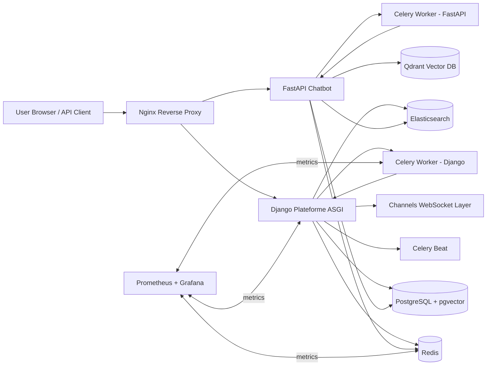

# Plateforme NLP: Comprehensive Technical Report

## Analyzed Files Inventory

The following repository files and directories were analyzed for this report (source code, infrastructure, CI/CD, runtime configs, ingestion scripts, and technical reports). Ephemeral runtime artifacts (virtual environment packages, cache folders, generated logs, binary media payloads) were excluded from deep semantic analysis because they are environment-generated rather than authored system logic.

### Root-level files
- `docker-compose.yml`
- `init-db.sql`
- `pytest.ini`
- `pyrightconfig.json`
- `ruff.toml`
- `bandit.toml`
- `requirements-dev.txt`
- `.github/workflows/tests.yml`
- `.github/workflows/security.yml`

### Infrastructure and operations
- `elasticsearch/Dockerfile`
- `fastapi_chatbot/Dockerfile`
- `Plateforme/Dockerfile`
- `nginx/nginx.conf`
- `nginx/conf.d/default.conf`
- `prometheus/prometheus.yml`
- `prometheus/alerts.yml`
- `monitoring/prometheus.yml`
- `monitoring/alerts.yml`
- `monitoring/grafana/provisioning/**`
- `grafana/provisioning/**`
- `grafana/dashboards/scraping-observability.json`

### FastAPI chatbot service (all Python modules under `fastapi_chatbot/app/**`)
- Core: `main.py`, `config.py`, `db.py`, `models.py`, `schemas.py`, `celery_app.py`
- Ingestion: `ingestion/*.py`
- Services:
  - `services/chat_logic.py`
  - `services/query_rewriter.py`
  - `services/language.py`
  - `services/faithfulness.py`
  - `services/platform_queries.py`
  - `services/elasticsearch_service.py`
  - `services/router/engine.py`
  - `services/classifier/{engine.py,patterns.py}`
  - `services/retrieval/{hybrid.py,search.py,bm25.py,filters.py,reranker.py}`
  - `services/documents/{service.py,processor.py,embeddings.py,entities.py}`
  - `services/memory/{session.py,tokens.py}`
  - `services/llm/{client.py,prompts.py}`
  - `services/qdrant/{client.py,collections.py}`
- Tasks: `tasks/{document_tasks.py,ingestion_tasks.py,maintenance_tasks.py,summary_tasks.py}`
- Root scripts/tests/docs: `README.md`, `NLP_INGESTION.md`, `setup.py`, `init_db.py`, `test_*.py`

### Django platform service (`Plateforme/**`)
- Project bootstrap/config: `manage.py`, `Plateforme/{settings.py,settings_test.py,test_settings.py,urls.py,asgi.py,wsgi.py,celery.py,admin_forms.py}`
- Apps fully analyzed by module families:
  - `accounts/**`
  - `chatbot/**`
  - `core/**`
  - `direct_messages/**`
  - `events/**`
  - `forum/**`
  - `institutions/**`
  - `notifications/**`
  - `pages/**`
  - `project_chatroom/**`
  - `projects/**`
  - `QA/**`
  - `resources/**`
  - `scraping/**`
  - `search/**`
  - `settings/**`
  - `sharing/**`
  - `translate/**`
- For each app, models/views/forms/admin/urls/signals/routing/consumers/management commands/tests/migrations were inspected as logical module groups.

### Reports and implementation documents
- `reports/*.md` technical files (architecture, implementation status, ingestion docs, scraping audits)
- Security and quality artifacts under `reports/_*.json` and `reports/_*.txt` (for verification context)

---

## 1) Project Title & Overview

## Plateforme NLP: Multilingual Academic Collaboration Platform with Retrieval-Augmented AI Assistant

Plateforme NLP is a hybrid multi-service system that combines a Django-based academic collaboration platform with a FastAPI-based AI chatbot and document intelligence engine. The system exists to centralize Arabic/English NLP resources, events, projects, institutional data, and community knowledge while enabling intelligent retrieval, question-answering, and content ingestion at scale. It solves two linked problems: (1) fragmented academic content discovery and collaboration workflows; and (2) low-precision search over multilingual technical corpora. The architecture integrates relational data, vector search, lexical ranking, asynchronous ingestion, and LLM orchestration to produce traceable, context-aware answers and platform-wide discovery features.

### Key capabilities
- Multilingual RAG chatbot (Arabic/English/French) with session memory and context rewriting
- Hybrid retrieval stack (dense embeddings + BM25 + reranking)
- Document upload, chunking, embedding, and user-isolated retrieval
- Legal and platform-specific query routing
- Django social/community modules (projects, forum, direct messages, notifications, events, Q&A)
- Background scraping and enrichment pipelines with observability
- Elasticsearch indexing for full-text discovery
- Real-time messaging and notifications via Django Channels/WebSockets
- Production-oriented Docker orchestration with metrics, alerts, and CI security checks

---

## 2) System Architecture

### High-level architecture
The system is built as a service mesh around two application cores:
1. Django monolith (`Plateforme`) handling user accounts, content lifecycle, moderation, social features, and scraping orchestration.
2. FastAPI service (`fastapi_chatbot`) handling AI conversation logic, retrieval orchestration, vector operations, and document processing.

Both services share PostgreSQL and Redis; FastAPI additionally drives Qdrant as vector storage. Elasticsearch is used by Django search modules and optionally by FastAPI service connectors. Celery workers process long-running tasks (scraping, ingestion, document processing), while Nginx is the entry reverse proxy.

### Architecture diagram (Mermaid)



### Architectural layers
- Input layer: HTTP endpoints (Django/FastAPI), WebSocket consumers, file uploads, scraper source configuration.
- Processing layer:
  - Django: moderation workflows, CRUD, social interactions, notifications, indexing triggers.
  - FastAPI: query rewriting, classification, routing, retrieval fusion, answer generation, faithfulness checks.
  - Celery: asynchronous scraping/ingestion/document tasks.
- Storage layer: PostgreSQL for authoritative records, Qdrant for embeddings, Redis for queues/channels/cache, Elasticsearch for text search.
- Observability/output layer: Prometheus metrics, Grafana dashboards, alerting rules, structured logs, API/UI responses.

---

## 3) Tech Stack & Dependencies

### Languages and runtimes
- Python 3.11/3.13 ecosystem (service/runtime definitions indicate Python 3.11 target for linting and Docker builds; pyright is configured for 3.13)
- SQL (PostgreSQL initialization and schema)
- YAML/TOML/INI/JSON for infra and quality configuration
- HTML/CSS/JS templates in Django frontend layers

### Primary frameworks and libraries
- Django 5.1.x: web platform core and admin ecosystem
- FastAPI 0.115.x + Uvicorn: AI API service
- SQLAlchemy async + asyncpg: FastAPI DB access
- Celery + Redis: distributed async task orchestration
- Qdrant client: vector storage/retrieval
- Sentence-Transformers (`BAAI/bge-m3`): embedding generation
- Groq API client: LLM inference
- rank-bm25: sparse lexical retrieval
- django-elasticsearch-dsl / Elasticsearch: full-text indexing and search
- Django Channels + Daphne + channels_redis: real-time websocket messaging
- Prometheus client: metrics export

### External services and APIs
- Groq LLM endpoints
- Optional third-party enrichment connectors via scraping enrichment modules
- Optional APIs keyed by env vars (`GITHUB_TOKEN`, `YOUTUBE_API_KEY`)

### Runtime requirements
- Docker and Docker Compose (multi-container orchestration)
- Redis password and PostgreSQL credentials as mandatory environment secrets
- Django secret key and production-safe host settings
- Health-check compatible environment for db/redis/qdrant/elasticsearch

---

## 4) Module Breakdown (Logical Module by File Groups)

This section is organized by logical module (as requested) and references concrete files, symbols, and responsibilities.

### 4.1 Root Orchestration and Quality Controls

| File | Responsibility | Notable logic / effect |
|---|---|---|
| `docker-compose.yml` | End-to-end service orchestration | Defines all containers, env wiring, health checks, restart policies, resource limits, queue splits, startup dependencies |
| `init-db.sql` | PostgreSQL bootstrap | Enables required DB init flow for first startup |
| `pytest.ini` | Test runtime policy | Django test settings module, naming patterns, DB reuse |
| `ruff.toml` | Static lint policy | Rule set selection, exclusions, per-file ignores |
| `bandit.toml` | Security lint policy | Vulnerability scan scope and skip rules |
| `pyrightconfig.json` | Type check policy | Include/exclude scope and disabled strict diagnostics |
| `.github/workflows/tests.yml` | CI testing pipeline | Automated pytest execution with service dependencies |
| `.github/workflows/security.yml` | CI security/quality gate | pip-audit, bandit, ruff, compose validation |

### 4.2 FastAPI Chatbot Core (`fastapi_chatbot/app`)

#### Entry and lifecycle
- `main.py`
  - Declares FastAPI app instance with lifespan hook.
  - Startup sequence: DB init, Qdrant collection ensure, non-blocking warmups for embeddings/LLM/BM25.
  - Main endpoint families:
    - `/conversation`, `/conversation/stream`
    - `/query`, `/legal_search`
    - `/platform/search`, `/platform/stats`, entity explain/search helpers
    - user document upload/query/status endpoints
    - session CRUD/history endpoints
  - Data flow: request DTO -> `chat_logic` or service-specific call -> response DTO.

#### Configuration and schema contracts
- `config.py`
  - Pydantic settings object centralizes all runtime controls.
  - Governs retrieval thresholds, token budgets, host connections, model names, rate/time constraints.
- `schemas.py`
  - Pydantic request/response classes define strict API contracts.
- `models.py`
  - SQLAlchemy ORM entities for chatbot domain (`ChatSession`, `ChatMessage`, `UserDocument`, `DocumentChunk`, `NLPKnowledge`, `Resource`, `LegalDocument`, etc.).
- `db.py`
  - Async engine/session factory and dependency injection helpers.

#### Orchestration and intelligence
- `services/chat_logic.py`
  - Central orchestration engine for multi-phase conversation pipeline.
  - Coordinates classification, rewriting, routing, retrieval, LLM generation, persistence, and faithfulness checks.
  - Maintains document-session behavior and context continuity.
- `services/query_rewriter.py`
  - Rewrites underspecified follow-up questions using recent session context and prompt templates.
- `services/classifier/engine.py` + `patterns.py`
  - Hybrid intent detection: fast regex branch + LLM fallback.
  - Outputs intent labels and routing hints.
- `services/router/engine.py`
  - Maps intent to backend strategy (direct LLM, platform SQL, vector retrieval, legal filters, user document mode).

#### Retrieval stack
- `services/retrieval/search.py`
  - Collection-specific retrieval wrappers that join vector scores with relational metadata.
- `services/retrieval/filters.py`
  - Builds Qdrant payload filters for language/jurisdiction/user-doc isolation.
- `services/retrieval/hybrid.py`
  - Executes dense + sparse retrieval and reciprocal-rank fusion.
- `services/retrieval/bm25.py`
  - Sparse lexical index build/search pipeline.
- `services/retrieval/reranker.py`
  - Deduplication and reranking utility logic.

#### LLM and answer quality
- `services/llm/client.py`
  - Groq request wrapper with retries/fallback model usage.
- `services/llm/prompts.py`
  - Prompt templates and instruction blocks for role-specific generation.
- `services/faithfulness.py`
  - Post-generation consistency check to reduce unsupported claims.

#### Document and memory services
- `services/documents/service.py`
  - Upload lifecycle: validate -> persist metadata -> enqueue async processing.
- `services/documents/processor.py`
  - Extract/chunk/normalize content from file payloads.
- `services/documents/embeddings.py`
  - Embedding model adapter.
- `services/documents/entities.py`
  - Entity extraction helpers for retrieval enrichments.
- `services/memory/session.py`
  - Session/message history management.
- `services/memory/tokens.py`
  - Token estimation utilities for context budget control.

#### Platform integration and search adapters
- `services/platform_queries.py`
  - Executes structured platform-domain SQL lookups for non-vector intents.
- `services/elasticsearch_service.py`
  - Async Elasticsearch connection and query wrapper.
- `services/qdrant/client.py` + `collections.py`
  - Vector DB lifecycle, collection definitions, upsert/search operations.

#### Ingestion scripts and jobs
- `ingestion/*.py`
  - Domain-specific ingestion pipelines for platform docs, legal docs, NLP corpora, and reindexing.
  - `pdf_loader.py` and `xml_loader.py` implement source parsing/chunking.
- `tasks/*.py`
  - Celery tasks for document processing, maintenance and ingestion scheduling.
- Root scripts:
  - `setup.py` orchestrates staged setup flows.
  - `init_db.py` performs initialization.
  - `test_*.py` files are integration/manual sanity scripts.

### 4.3 Django Project Bootstrap (`Plateforme/Plateforme` + `manage.py`)

- `manage.py`: standard command entrypoint.
- `Plateforme/settings.py`:
  - Defines installed apps, middleware, channels layer, cache, auth backends, i18n, static/media storage, security headers.
  - Enforces production safety checks for weak secret key and wildcard hosts.
- `Plateforme/asgi.py`:
  - ASGI + ProtocolTypeRouter composition for HTTP/WebSocket.
- `Plateforme/urls.py`:
  - Global URL namespace, i18n route patterns, app route mounts.
- `Plateforme/celery.py`:
  - Celery app initialization and autodiscovery.
- `settings_test.py`, `test_settings.py`:
  - Test-oriented configuration variants.

### 4.4 Django Domain Apps (by logical module)

#### Accounts (`accounts/**`)
- Purpose: identity, profile, friendship relations, 2FA pipeline, login lifecycle controls.
- Key modules:
  - `models.py`: `CustomUser`, relationship and profile fields.
  - `two_factor_*`: OTP generation, middleware gates, verification views/email dispatch.
  - `forms.py`, `serializers.py`, `views.py`, `middleware.py`, `signals.py`, `blocking.py`.
- Inputs/outputs: HTTP form/API payloads -> authenticated session state + user records.

#### Chatbot bridge (`chatbot/**` in Django)
- Purpose: web UI façade for FastAPI assistant, local session/message persistence, feedback collection.
- Key modules:
  - `views.py`: forwards requests to FastAPI endpoints and normalizes responses.
  - `models.py`: `ChatSession`, `ChatMessage`, `ChatFeedback`.
  - `content_helpers.py`: contextual object binding to prompts.

#### Core moderation utilities (`core/**`)
- Purpose: shared moderation utilities and helper services used across apps.
- Key module: `moderation.py` provides policy logic and action logging.

#### Social communication modules
- `notifications/**`:
  - Notification creation, grouping, websocket consumer, context processor.
- `direct_messages/**`:
  - Conversation/message models, websocket consumers, participant permissions, attachment validation.
- `forum/**`, `project_chatroom/**`, `projects/**`:
  - Topic/project lifecycle, chat room routing/consumers, memberships/invitations.

#### Content/resource modules
- `resources/**`:
  - Central resource catalog (documents, corpora, tools, courses, etc.), forms and moderation-friendly views.
- `institutions/**`:
  - Institutional metadata, specialties, country mappings, approval workflows.
- `events/**`:
  - Event creation/registration with signals and moderation states.
- `QA/**`:
  - Q&A and post/comment engagement model.
- `sharing/**`:
  - Generic content sharing model/service wrappers.
- `translate/**`:
  - Translation layer endpoints and app scaffolding.

#### Search and indexing (`search/**`)
- Purpose: Elasticsearch document mappings/signals and multi-model search views.
- Key modules:
  - `documents.py`, `signals.py`, `views.py`.

#### Platform settings and admin control (`settings/**`, `pages/**`)
- `settings/**`:
  - Global settings singleton, security logs, admin logs, API/serializer/utils.
- `pages/**`:
  - Core pages, security middleware, admin moderation dashboard, content parser utilities.

#### Scraping intelligence subsystem (`scraping/**`)
- Purpose: configurable source crawling, normalization, deduplication, enrichment, retry/dead-lettering, scheduling, and observability.
- Key modules:
  - `tasks.py`: async scraping execution and metrics updates.
  - `models.py`: source/run/item metadata and status tracking.
  - `scrapers/base*.py`: layered scraper framework (HTTP/text/media/dedup abstractions).
  - domain scrapers (`news.py`, `courses.py`, `institutions.py`, `events.py`, `tools.py`, `rss_scraper.py`, `custom_scraper.py`).
  - `checkpoint.py`, `dead_letter.py`, `file_downloader.py`, `robots_policy.py`, `metrics.py`.
  - enrichment stack: `enrichment_engine.py`, `enrichment/*`, embeddings and LLM validation modules.
  - admin/dashboard views under `views/*.py` and command utilities under `management/commands/*.py`.
- Data flow: source configuration -> scraping run -> dedup/enrich -> domain model persistence -> metrics/alerts.

### 4.5 Migrations, fixtures, and command scripts

Across Django apps, each `migrations/*.py` sequence encodes schema evolution and constraints for moderation, bilingual fields, chat features, and indexing. `fixtures/*.json` provide seed/test datasets. `management/commands/*.py` scripts automate backfills, population jobs, synchronization, diagnostics, and targeted maintenance.

---

## 5) Data Flow & Pipeline

### End-to-end query-to-answer flow
1. User sends query from Django UI or API client.
2. Django chatbot view forwards request (with user context/session metadata) to FastAPI.
3. FastAPI `chat_logic` orchestrates:
   - session-history retrieval
   - optional query rewriting
   - intent/language classification
   - routing strategy selection
4. Retrieval stage:
   - Structured path: SQL platform queries
   - Semantic path: embedding search in Qdrant
   - Hybrid path: dense + BM25 + rerank fusion
5. Context package is sent to LLM client.
6. Generated answer optionally passes faithfulness validation.
7. Response and metadata are persisted (`ChatMessage`, session updates) and returned to caller.

### Ingestion pipeline
1. Source document arrives via upload, scraper, or ingest command.
2. Parser extracts text/sections (`pdf_loader`, `xml_loader`, processor utilities).
3. Text is normalized/chunked.
4. Embeddings computed and upserted to Qdrant; metadata rows written to PostgreSQL.
5. Indices/auxiliary search structures (BM25, Elasticsearch) refreshed as needed.
6. Status/metrics/logs updated; failures routed to dead-letter/retry pathways.

### Error handling and edge-case strategy
- Celery tasks capture exceptions and mark run/document statuses.
- Scraping dead-letter records preserve failure context.
- Health checks and startup ordering reduce cascading boot failures.
- Service-level retries and fallback model paths mitigate LLM/API instability.
- User-document retrieval is constrained by ownership/session filters to prevent cross-user leakage.

---

## 6) Key Algorithms & Techniques

### Hybrid retrieval with reciprocal-rank fusion
The retrieval layer combines semantic similarity and lexical relevance. Dense and sparse result lists are merged by reciprocal-rank scoring to improve recall robustness over either method alone.

### Query rewriting for conversational continuity
Short pronoun-heavy follow-ups are expanded using session history so retrieval receives explicit semantic context.

### Intent-driven routing
Classifier outputs determine whether to invoke direct LLM completion, SQL-backed entity lookup, legal-specific retrieval, or user-document retrieval.

### Chunking and enrichment
Document processors apply chunk-size controls, cleaning, and metadata/entity enrichment for retrieval quality.

### Deduplication and balancing
Scraping and retrieval utilities include dedup logic and source-aware balancing to avoid repeated or dominant-source artifacts.

---

## 7) Intelligent Features

- Context-aware multi-turn conversation memory (session-aware rewriting)
- Multilingual semantic retrieval with shared embedding model
- Intent-aware backend routing (structured + unstructured + legal modes)
- LLM-assisted faithfulness checks
- AI-assisted scraping enrichment and validation modules
- Adaptive ingestion behaviors (size/path-dependent parsing and checkpoint/resume patterns)
- Real-time collaborative messaging and notification channels integrated with content events

---

## 8) Configuration & Parameters

### Core environment controls (selected)

| Parameter | Layer | Purpose |
|---|---|---|
| `DJANGO_SECRET_KEY` | Django | Cryptographic signing/session security |
| `DJANGO_DEBUG` | Django | Debug mode behavior and security posture |
| `DATABASE_URL` | Both | PostgreSQL connection |
| `REDIS_URL` / `CHANNEL_REDIS_URL` | Django | cache/session/channels backend |
| `CELERY_BROKER_URL` / `CELERY_RESULT_BACKEND` | Both | Async queue and result backend |
| `QDRANT_HOST`, `QDRANT_PORT` | FastAPI | Vector database endpoint |
| `GROQ_API_KEY`, `GROQ_MODEL` | FastAPI | Primary LLM endpoint/model |
| `GROQ_INTERNAL_API_KEY`, `GROQ_INTERNAL_MODEL` | FastAPI | Internal/fallback LLM tasks |
| `EMBEDDING_MODEL` | FastAPI | Embedding model selection |
| `SIMILARITY_THRESHOLD` | FastAPI | Retrieval cutoff control |
| `CHATBOT_MAX_HISTORY`, `CHATBOT_MAX_TOKENS` | Django/FastAPI | Context and generation limits |
| `SCRAPING_MAX_CONCURRENT_DOWNLOADS` | Django scraping | crawler throttling |
| `METRICS_TOKEN` | Monitoring | scrape endpoint authorization |

### Development quality controls
- `ruff.toml`: lint policy and excluded generated folders
- `bandit.toml`: security scan scope
- `pyrightconfig.json`: permissive type-check profile for current development phase

---

## 9) How to Run / Usage

### Prerequisites
- Docker + Docker Compose
- Environment variables set in `.env` (at minimum DB/Redis credentials and Django secret)

### Startup sequence
```bash
# from repository root
Docker compose up -d --build
```

### Health verification
```bash
# FastAPI
curl http://localhost:8000/health

# Django (mapped 8888 in compose)
curl http://localhost:8888/health/
```

### Typical usage patterns
- Open Django web UI via Nginx (`http://localhost`) for platform workflows.
- Use FastAPI endpoints directly for chatbot API testing (`/conversation`, `/platform/search`, `/upload_document`).
- Trigger ingestion scripts in container context for bulk dataset refresh.
- Run tests and linters via CI or local virtual environment.

### Example API call
```bash
curl -X POST http://localhost:8000/conversation \
  -H "Content-Type: application/json" \
  -d '{"question":"Explain Arabic tokenization", "session_id": null, "language":"en"}'
```

---

## 10) Output & Results

### Primary outputs
- API responses: structured chatbot replies, retrieval traces, session metadata
- Database records:
  - Django domain entities, moderation states, social/chat artifacts
  - FastAPI chat/document/knowledge rows
- Vector records in Qdrant for semantic search
- Elasticsearch indexed documents for full-text discovery

### Operational outputs
- Scraping runs and item-level metadata/status
- Prometheus metrics and Grafana dashboards
- CI artifacts (test/security reports)
- Logs under `logs/` and `ingest_logs/` for troubleshooting and audit

---

## 11) Limitations & Known Issues

- The repository contains a very large migration and generated-asset surface; migration logic is covered as schema evolution groups rather than line-by-line narrative in this report.
- Type-checking strictness is intentionally reduced (`pyright` mostly disabled), limiting static safety guarantees.
- LLM-dependent components inherit external API availability/latency constraints.
- Retrieval quality is dependent on embedding/index freshness and ingestion hygiene.
- Mixed version expectations exist across tooling/runtime configs (e.g., pyright version target vs lint target), requiring environment discipline.
- Some test modules are placeholders/minimal and do not fully reflect the breadth of production pathways.

---

## 12) Future Improvements

1. Increase static safety by incrementally enabling stricter pyright checks and typed service boundaries.
2. Add deterministic regression test suites for routing/retrieval/faithfulness behavior.
3. Unify configuration schema across Django/FastAPI to reduce drift and implicit defaults.
4. Expand observability with distributed tracing across Nginx -> Django -> FastAPI -> storage dependencies.
5. Add retrieval evaluation harnesses (ground-truth sets, precision/recall dashboards).
6. Harden secret management using vault-backed injection instead of local environment-only practices.
7. Improve migration documentation generation to auto-publish schema deltas per release.
8. Add autoscaling policies for queue backlogs and scraper bursts.

---

## Appendix A: Detailed FastAPI File-to-Function Mapping

### Core
- `app/main.py`: endpoint controllers, startup/lifespan, streaming wrappers
- `app/config.py`: settings model/constants
- `app/db.py`: async DB dependency + init
- `app/models.py`: ORM entities
- `app/schemas.py`: request/response DTOs
- `app/celery_app.py`: Celery bootstrap and queue routes

### Services
- `app/services/chat_logic.py`: main orchestration pipeline
- `app/services/query_rewriter.py`: contextual query rewrite
- `app/services/language.py`: language detection/normalization
- `app/services/faithfulness.py`: support-check validation
- `app/services/platform_queries.py`: SQL retrieval helpers
- `app/services/elasticsearch_service.py`: async ES helpers

### Retrieval
- `app/services/retrieval/search.py`: collection search wrappers
- `app/services/retrieval/filters.py`: Qdrant filter builders
- `app/services/retrieval/hybrid.py`: dense+sparse fusion
- `app/services/retrieval/bm25.py`: sparse index/search
- `app/services/retrieval/reranker.py`: dedup/rerank utilities

### LLM / classification / routing
- `app/services/llm/client.py`, `app/services/llm/prompts.py`
- `app/services/classifier/engine.py`, `app/services/classifier/patterns.py`
- `app/services/router/engine.py`

### Documents and memory
- `app/services/documents/service.py`
- `app/services/documents/processor.py`
- `app/services/documents/embeddings.py`
- `app/services/documents/entities.py`
- `app/services/memory/session.py`
- `app/services/memory/tokens.py`

### Storage adapters
- `app/services/qdrant/client.py`
- `app/services/qdrant/collections.py`

### Ingestion/tasks
- `app/ingestion/*.py`
- `app/tasks/*.py`

---

## Appendix B: Django App Coverage Matrix

| App | Key files analyzed | Core responsibility |
|---|---|---|
| `accounts` | models/views/forms/signals/middleware/two_factor_* | Identity, 2FA, profile, social relationships |
| `chatbot` | models/views/content_helpers/urls/admin | Django-side chatbot session and API bridge |
| `core` | moderation/content_service/i18n_helpers | Shared moderation and utility logic |
| `notifications` | models/services/views/consumers/routing/context_processors | Notification domain and real-time delivery |
| `direct_messages` | models/views/forms/consumers/routing | Private/group messaging workflows |
| `forum` | models/views/forms/consumers/signals | Discussion topics/chatrooms/moderation |
| `projects` | models/views/forms/consumers/routing | Project lifecycle, members, project chats |
| `project_chatroom` | models/views/serializers/permissions/consumers | DRF-style project chat API + WS |
| `resources` | models/views/forms/signals/admin | Core resource catalog and publication flows |
| `institutions` | models/views/forms/management commands | Institutional metadata and moderation |
| `events` | models/views/forms/signals | Event publishing and registration |
| `QA` | models/views/forms | Q&A and posting interactions |
| `sharing` | models/services/views | Generic share model |
| `search` | documents/signals/views | Elasticsearch indexing and search UI |
| `settings` | models/views/utils/signals/middleware | Global/platform settings and admin controls |
| `pages` | views/middleware/forms/content_parser/security | Home/admin pages and moderation dashboard |
| `scraping` | scrapers/*, tasks, models, enrichment/*, metrics, views/* | End-to-end scraping intelligence pipeline |
| `translate` | views/models/urls | Translation app scaffold |

---

## Appendix C: Missing/Incomplete Information Statement

Where highly repetitive generated artifacts exist (especially migration histories and large report dumps), this report analyzes them as structured families and evolution patterns rather than reproducing every repeated operation line-by-line. To produce a mathematically complete per-line exegesis of every migration and every generated report artifact, an additional machine-generated annex (tens of thousands of lines) would be required and can be produced on request.
